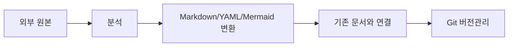

# 사용방법

## 기본 원칙

1. Obsidian/Git에는 가능한 한 **정리된 Markdown 지식과 프로젝트관리 정보**를 저장한다.
2. PDF, XLSX, DOCX, PPTX, HWP/HWPX, ZIP, PLC/SCADA 원본은 분석 입력자료이며 기본적으로 Vault/Git에 넣지 않는다.
3. 외부 원본을 받으면 내용을 분석한 뒤 기존 문서에 통합하거나 새 Markdown으로 재구성한다.
4. 원본 추적이 필요하면 Source ID, 원본 파일명, SHA256, 출처/수신일을 기록한다.
5. 같은 문서의 버전 파일을 복제하지 않고 Git History로 변경을 관리한다.
6. 회의록, 의사결정, 문제해결 기록은 관련 프로젝트 아래에 둔다.
7. Water-AI의 외부자료 처리 규칙은 [[20-Water-AI/00-프로젝트관리/24-자료-문서화-및-버전관리-규칙]]을 따른다.
8. 계획상 목표 / 현재 확인된 상태 / 추가 확인 필요 / 개발 제안을 구분한다.

## 외부자료 처리

## 문서 이름 권장 형식

- 회의록: `YYYY-MM-DD_회의주제`
- 의사결정: `DEC-YYYYMMDD-번호_결정제목`
- 문제해결: `ISSUE-YYYYMMDD-번호_문제제목`
- 기술문서: `주제-설명.md`
- 산출물: 파일명에 반복 버전을 붙이지 않고 Frontmatter `revision` + Git History 사용

## Water-AI

- 프로젝트관리: [[20-Water-AI/00-프로젝트관리/00-PM-대시보드]]
- 근거·소스: [[20-Water-AI/00-프로젝트관리/22-근거-소스맵]]
- 자료/버전 규칙: [[20-Water-AI/00-프로젝트관리/24-자료-문서화-및-버전관리-규칙]]
- 중랑: [[20-Water-AI/중랑/00-중랑-홈]]
