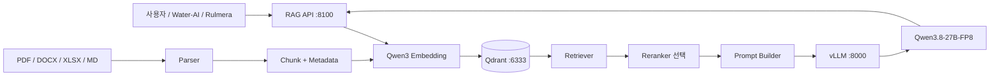

# Qwen-RAG 독립 프로젝트 — 구축 교본

> **목표:** 이 Vault만 보고 Windows 또는 Linux 서버에서 `Qwen/Qwen3.8-27B-FP8`을 실제로 띄우고, PDF/DOCX/XLSX/Markdown 문서를 적재하여 **파일·페이지·시트·행까지 근거가 나오는 RAG**를 구축한다.

## 우리가 최종적으로 만드는 것



질문 예:

> “중랑 A2 PILOT PLC에서 AI 수집 대상은 무엇이며 근거는 어느 파일의 어느 시트/행에 있는가?”

목표 응답:

```text
답변:
- ...

근거:
[S1] 중랑_PLC_XG5000_SCADA_DB_ETHERFOS_통합매핑_20260903.xlsx
     sheet=PLC_SCADA_DB, rows=120~135
[S2] XGI FEnet 기술자료.pdf, page=74
```

## 플랫폼 구성

| 구성요소 | 1차 선택 |
|---|---|
| LLM | Qwen/Qwen3.8-27B-FP8 |
| LLM Serving | vLLM |
| API 형식 | OpenAI-compatible |
| Embedding | Qwen/Qwen3-Embedding-0.6B |
| Vector DB | Qdrant |
| Reranker | Qwen/Qwen3-Reranker-0.6B, 2차 적용 |
| RAG API | FastAPI |
| 문서 | PDF, DOCX, XLSX, MD, CSV, TXT |
| 1차 GPU | RTX A6000 48GB |
| 최초 Context | 16K |
| Windows | WSL2 Ubuntu |
| Linux | Ubuntu native |

## 중요한 원칙

1. **모델 단독 기동부터 성공**시키고 RAG를 붙인다.
2. Windows에서는 vLLM을 네이티브 Windows에 억지로 설치하지 않고 **WSL2**를 표준 경로로 사용한다.
3. A6000에서는 FP8이라는 이름만 보고 성능을 가정하지 않고 실제 kernel/VRAM/안정성을 검증한다.
4. LLM venv와 RAG venv를 분리한다.
5. Excel은 평문으로 뭉개지 않고 **시트·행·Header**를 보존한다.
6. PDF는 **페이지 번호**를 보존한다.
7. 답변 품질과 검색 품질을 분리 평가한다.
8. 근거가 없으면 “근거 없음”이라고 처리한다.
9. 같은 문서의 구버전/복사본이 검색 상위를 점령하지 않게 hash/version 정책을 둔다.
10. Qdrant와 vLLM은 기본적으로 인터넷에 직접 노출하지 않는다.

## 전체 구축 순서

```text
0. GPU / OS / Driver 확인
1. vLLM 설치
2. Qwen3.8-27B-FP8 16K로 기동
3. /v1/models / chat completions 확인
4. Qdrant 설치
5. Qwen3 Embedding 확인
6. 문서 Parser
7. Chunk + Metadata
8. Vector 적재
9. 검색 /search
10. LLM 결합 /ask
11. 출처 [S1] 표시
12. Reranker 비교
13. 평가셋
14. 운영/백업
15. Water-AI / Rulmera 실제 적용
```

## 목차

### 프로젝트 관리
- [[00-프로젝트관리/00-PM-대시보드]]
- [[00-프로젝트관리/01-프로젝트헌장]]
- [[00-프로젝트관리/02-WBS-구축로드맵]]
- [[00-프로젝트관리/03-의사결정로그]]
- [[00-프로젝트관리/04-용어사전]]
- [[00-프로젝트관리/05-구축전-체크리스트]]

### 아키텍처
- [[10-아키텍처/00-전체아키텍처]]
- [[10-아키텍처/01-포트-디렉터리-환경변수]]
- [[10-아키텍처/02-하드웨어-용량산정]]
- [[10-아키텍처/03-A6000-FP8-주의사항]]

### Windows
- [[20-Windows/00-Windows-권장구성]]
- [[20-Windows/01-WSL2-설치]]
- [[20-Windows/02-GPU-CUDA-검증]]
- [[20-Windows/03-vLLM-Qwen-설치-기동]]
- [[20-Windows/04-Qdrant-Docker]]
- [[20-Windows/05-RAG-API-실행]]
- [[20-Windows/06-Windows-문제해결]]

### Linux
- [[30-Linux/00-Ubuntu-권장구성]]
- [[30-Linux/01-NVIDIA-Driver-검증]]
- [[30-Linux/02-Python-vLLM-Qwen]]
- [[30-Linux/03-Docker-NVIDIA-Toolkit]]
- [[30-Linux/04-Qdrant]]
- [[30-Linux/05-systemd-서비스화]]
- [[30-Linux/06-Linux-문제해결]]

### RAG
- [[40-RAG/00-RAG-원리]]
- [[40-RAG/01-Embedding]]
- [[40-RAG/02-Qdrant-VectorDB]]
- [[40-RAG/03-Chunk-Metadata]]
- [[40-RAG/04-PDF-DOCX-XLSX-MD-파싱]]
- [[40-RAG/05-Retrieval-Reranker]]
- [[40-RAG/06-Prompt-출처추적]]
- [[40-RAG/07-RAG-API]]
- [[40-RAG/08-증분인덱싱-중복관리]]
- [[40-RAG/09-멀티모달-확장]]

### 운영 / 검증 / 적용
- [[60-운영/00-보안]]
- [[60-운영/01-백업복구]]
- [[60-운영/02-모니터링로그]]
- [[60-운영/03-성능튜닝-A6000]]
- [[60-운영/04-업데이트-롤백]]
- [[70-검증/00-단계별-완료기준]]
- [[70-검증/01-평가셋-설계]]
- [[70-검증/02-장애진단-플로우]]
- [[80-적용/00-Water-AI-적재설계]]
- [[80-적용/01-Rulmera-적재설계]]
- [[80-적용/02-Obsidian-Vault-RAG]]
- [[99-참고/00-공식문서-링크]]
- [[99-참고/01-명령어-치트시트]]

## 실제 실행 코드

`25-Qwen-RAG/50-실습코드/`에는 교본에서 설명하는 구조를 그대로 구현한 최소 RAG 코드가 들어간다.

- `rag_app/parsers.py` — PDF/DOCX/XLSX/MD/CSV
- `rag_app/embeddings.py`
- `rag_app/vectorstore.py`
- `rag_app/ingest.py`
- `rag_app/retrieve.py`
- `rag_app/llm.py`
- `rag_app/api.py`
- `docker-compose.qdrant.yml`
- Windows/Linux 점검 스크립트
- vLLM 실행 스크립트
- systemd unit 예제
