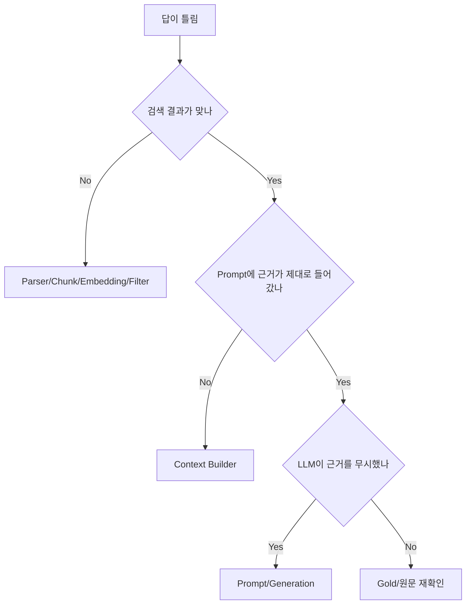

# 장애진단 플로우

## Citation 위치가 틀림
대부분 parser metadata 문제다. LLM 문제로 오판하지 않는다.

## Excel
- header
- row range
- data_only
- merged cell
- 빈 행
확인.

## 검색 0건
- collection point count
- project/site filter
- is_current
- dimension
- embedding model
