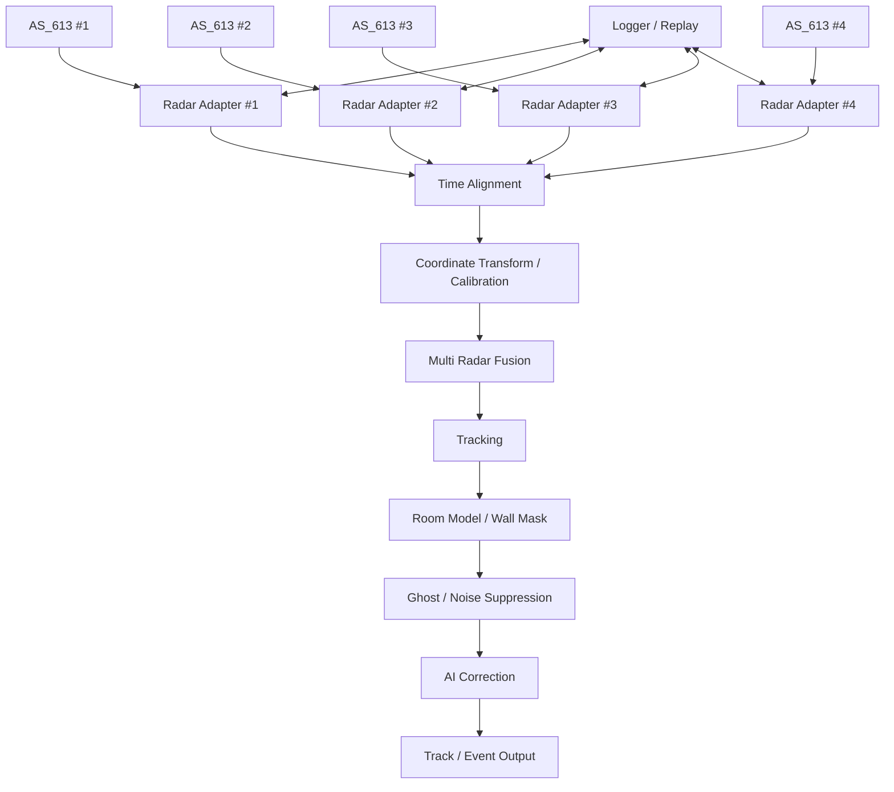

# Rulmera Radar 시스템 아키텍처

## 전체 구조

## 설계 핵심
Rulmera는 AS_613 내부의 원 신호처리를 재구현하는 것부터 시작하지 않는다. 먼저 **Vendor 출력과 Rulmera 시스템 사이에 Adapter 경계**를 둔다. 이 경계 덕분에 나중에 Detection/Angle/RD/Raw가 공개되어도 상위 Fusion 구조를 깨지 않고 확장할 수 있다.

## PC Reference Engine
PC 버전은 디버그 가능한 정답 기준 구현이다.
- Live mode
- Record mode
- Replay mode
- Step frame
- Sensor mute
- Artificial delay/jitter injection
- Visualization
- Metrics export

## Edge Hub
Edge 버전은 동일 알고리즘의 경량판이다.
- Sensor input
- Calibration matrix
- Fusion/Tracking
- Room Mask
- 경량 AI
- Event output
- Health/diagnostic
