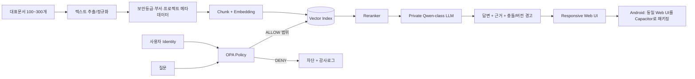

# Rulmera OPA Enterprise Knowledge

> **목표:** 회사의 문서·기술자료·숙련자 경험을 승인된 지식으로 정본화하고, 사용자의 회사·부서·업무·프로젝트·인가레벨을 먼저 판정한 뒤 **허용된 지식만** 검색하여 근거와 함께 설명하는 사내 AI 선임자.

## 프로젝트 책임
- **총괄 / PM / 제품책임 / 전체 개발:** 룰메라팀 **윤석훈 팀장**
- **마케팅·영업:** 룰메라팀 **김일형 / 코이넷 대표**
- **PoC 고객 기술책임자:** 미정 — 자료 제공, 사실 검증, 지식 승인, 현장 인수 역할

## 기준선
- 기획 기준: `Rulmera_OPA_Enterprise_Knowledge_기획안_남동공단_20260915.pptx`
- 전체 목표 일정: **2026-09-16 ~ 2027-03-15, 약 6개월**
- 일정은 PoC 데이터 확보·고객 피드백·성능 결과에 따라 변경 가능하며 변경로그로 관리한다.
- GPU 기준: **NVIDIA RTX A6000 48GB**
- LLM: **Qwen 20~30B급을 1차 목표**로 하되 A6000 Ampere에서 실제 추론 가능한 양자화 구성을 벤치마크 후 확정한다.
- 사실지식은 **RAG 우선**, Fine-tuning은 말투·응답형식·업무패턴 최적화가 필요할 때 후순위로 시행한다.

## 가장 빠른 검증 경로
**10영업일 Vertical Slice PoC**를 먼저 만든다. 대규모 자료를 기다리지 않고 100~300개 대표문서 + 50개 정답질문 + 권한 누출 시험세트로 아래 전체 흐름을 끝까지 연결한다.

## 바로가기
- [[00-프로젝트관리/00-PM-대시보드|PM 대시보드]]
- [[00-프로젝트관리/01-프로젝트헌장|프로젝트 헌장]]
- [[00-프로젝트관리/06-요구사항추적표|요구사항 추적표]]
- [[00-프로젝트관리/07-범위-WBS|WBS]]
- [[20-설계/01-전체-아키텍처|전체 아키텍처]]
- [[20-설계/02-RAG-지식파이프라인|RAG·지식 파이프라인]]
- [[20-설계/03-OPA-권한모델|OPA 권한모델]]
- [[20-설계/04-클라이언트-UI-설계|Web/Android 공통 UI]]
- [[30-개발/01-10일-PoC-개발계획|10일 PoC]]
- [[40-시험-검증/01-PoC-검증계획|PoC 검증계획]]
- [[20-설계/06-인프라-장비-계획|장비·예산]]

## 작업 원칙
1. 사실/근거/결정/변경을 문서로 남긴다.
2. 요구사항은 `REQ-*` ID로 추적한다.
3. 권한은 LLM 프롬프트가 아니라 **OPA가 Retrieval 전에 판정**한다.
4. 승인되지 않은 지식은 답변 정본으로 사용하지 않는다.
5. 하나의 Responsive Web UI 코드베이스를 데스크톱 브라우저와 Android에서 재사용한다.
6. 처음부터 큰 시스템을 만들지 않고, 10일 PoC → 측정 → 보완 → 확장의 순서로 진행한다.
