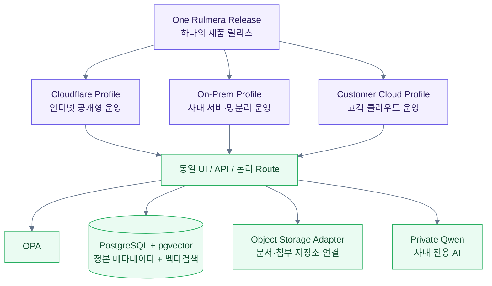

# Rulmera OPA Enterprise Knowledge v0.9

> [!summary]
> 이 문서는 프로젝트 전체 방향, 핵심 원칙, 운영 개념을 한눈에 보여주는 기준 문서다.

> [!info]
> 표기 기준: 전문 용어는 가능하면 `원어(알기 쉬운 설명)` 형식을 사용하고, 공통 기준은 [[20-설계/00-용어-스타일-가이드]]를 따른다.

## 이번 v0.4 마이그레이션 핵심
- **일반 사용자 중심 설명**으로 용어를 정리했다.
- Mermaid 도면을 **컬러 강조형**으로 바꾸고, 단계별 흐름이 눈에 잘 들어오게 했다.
- 핵심 용어는 **원어(알기 쉬운 설명)** 형식으로 병기했다.
- AI 답변과 기업 지식 웹 링크가 같은 권한체계를 쓰도록 구조를 더 명확히 했다.


## v0.6 실전 패키지 추가
- Quartz v5용 `quartz/styles/custom.scss` 실전 배치 파일 추가
- Obsidian 기본 Templates 6종 + Templater 6종 추가
- Obsidian CSS Snippet 유지
- 발표용 `Rulmera_OPA_Architecture_1Page_v0.6.pptx` 생성
- PPT/Markdown/Mermaid가 같은 컬러·용어 규칙을 사용하도록 통일


## v0.8 Agentic Worker / Action OPA 추가
- Qwen을 답변 모델에만 두지 않고 **계획·Tool Call을 만드는 실행 오케스트레이션 두뇌**로 확장
- `Knowledge OPA`와 별도로 **Action OPA(작업 실행 권한)** 추가
- `Worker Controller → Job Queue → Execution Worker → Result Contract` 정식 구조 추가
- 기존 `ingestion-worker`는 지식 수집용으로 유지하고 `execution-worker`와 분리
- Git은 필수 저장소가 아니라 **선택적 Source/Job/Audit Adapter**로 정의
- 상세: [[20-설계/10-Qwen-Worker-실행아키텍처]], [[20-설계/11-Worker-Job-Contract]]

## v0.9 Secure Agentic Worker 기준선
- Worker Controller를 **PEP(Policy Enforcement Point, 정책 집행 지점)**으로 고정하고, OPA를 **PDP(Policy Decision Point, 정책 판단 지점)**으로 명확히 분리
- Qwen의 Job 초안은 바로 실행하지 않고 Controller가 실제 Path/Argument/Environment를 **Canonical Job(정규 작업 요청)**으로 확정
- 고위험 사람승인은 **Job Hash(작업 해시)**와 결합하여 승인 후 작업내용 변경을 차단
- Tool 이름뿐 아니라 대상 Resource/Path/Argument/Network/Environment까지 OPA 판정
- **Durable Workflow(내구성 작업흐름)** 추상계층 추가: 장시간 작업 상태 영속, Retry(재시도), Timeout(제한시간), 장애복구
- Temporal은 장기·고신뢰 운영 후보로 두되 PoC Core 필수 의존성으로 고정하지 않음
- 실행형 설계문서의 핵심 영문용어는 최초 1회 이상 한국어 풀이를 필수 적용
- 상세: [[20-설계/10-Qwen-Worker-실행아키텍처]], [[20-설계/12-Durable-Workflow-설계]], [[20-설계/13-Action-Authorization-Enforcement]]

## 핵심 용어 빠른 이해
| 용어 | 쉬운 뜻 |
|---|---|
| Identity(사용자 신원) | 지금 접속한 사람이 누구인지 확인하는 정보 |
| OPA(Open Policy Agent, 접근정책 엔진) | 이 사용자가 어떤 자료를 볼 수 있는지 판단하는 규칙 엔진 |
| Retrieval(검색 회수) | 질문에 맞는 회사 자료를 찾아오는 과정 |
| RAG(Retrieval-Augmented Generation, 검색증강생성) | 회사 자료를 찾아 AI 답변에 붙여 주는 방식 |
| Citation(근거 표시) | 답변이 어떤 문서에 근거했는지 보여주는 표시 |
| Deep Link(원문 바로가기) | 지식 웹의 정확한 문서 위치로 이동하는 링크 |
| Answer Contract(표준 응답 규격) | AI가 반드시 이 형식으로만 답하도록 정한 응답 구조 |
| Continuous Ingestion(지속 수집) | 새 파일이 들어오면 자동으로 감지·분류·승인 흐름에 태우는 구조 |
| Action OPA(실행권한) | 사용자가 AI에게 특정 작업을 실행시킬 수 있는지 판단하는 정책 |
| Worker Controller(작업 배차기) | 승인된 JOB을 검증하고 적절한 Worker에 전달·상태관리하는 서비스 |
| Execution Worker(실행 작업기) | 파일·코드·문서·테스트·빌드·배포를 실제 수행하는 격리 실행기 |
| PEP(Policy Enforcement Point, 정책 집행 지점) | OPA 판단결과를 실제 실행 차단/허용에 적용하는 Controller 역할 |
| PDP(Policy Decision Point, 정책 판단 지점) | 정책을 평가해 허용·거부·승인필요를 결정하는 OPA 역할 |
| Job Hash(작업 해시) | 승인한 작업과 실제 실행 작업이 같은지 확인하는 고정 지문 |
| Durable Workflow(내구성 작업흐름) | 장애가 나도 작업 진행상태를 보존하고 이어서 실행하는 방식 |
| Activity(개별 실행 작업) | Workflow 안에서 실제 수행되는 문서변환·테스트·빌드 같은 한 단계 |
| Task Queue(작업 대기열) | Worker가 가져갈 실행 작업을 쌓아두는 통로 |

## 전체 운영 개념도
```mermaid
%%{init: {"theme":"base","themeVariables":{"primaryColor":"#F8FAFC","primaryTextColor":"#1F2937","primaryBorderColor":"#64748B","lineColor":"#64748B","secondaryColor":"#EAF4FF","tertiaryColor":"#EAFBF2","clusterBkg":"#F8FAFC","clusterBorder":"#CBD5E1","fontSize":"15px"}} }%%
flowchart LR
    U[직원<br/>Employee(사내 사용자)] --> ID[Identity<br/>사용자 신원 확인]
    ID --> OPA[OPA<br/>접근 허가 판정]
    OPA -->|허용된 범위| RET[Authorized Retrieval<br/>허용된 지식 검색]
    OPA -->|거부| DENY[DENY<br/>차단 + 감사로그]
    RET --> KB[(Approved Knowledge<br/>승인된 회사 지식)]
    KB --> Q[Qwen<br/>질문응답 AI]
    Q --> RC[Answer Contract<br/>표준 응답 데이터]
    RC --> UI[Rulmera Web Template<br/>회사 지식 웹 화면]
    UI --> LINK[Deep Link<br/>원문 바로가기]

    SRC[새 파일·새 프로젝트<br/>신규 자료 유입] --> ING[Continuous Ingestion<br/>지속 지식 수집]
    ING --> CLS[AI Classification<br/>자동 분류 후보 생성]
    CLS --> APP{Approval<br/>승인 필요 여부}
    APP -->|저위험 자동승인| KB
    APP -->|중요자료 사람확인| REV[Review<br/>사람 검토·승인]
    REV --> KB

    Q -->|실행 요청| CTRL[Worker Controller / PEP<br/>정책 집행·정규화]
    CTRL --> AOPA[Action OPA / PDP<br/>실행권한 판정]
    AOPA -->|거부| ADENY[DENY<br/>실행 차단 + 감사]
    AOPA -->|허용/승인완료| WF[Durable Workflow<br/>상태보존·재시도·복구]
    WF --> EW[Execution Worker<br/>실제 작업 수행]
    EW --> VR[Validation / Result<br/>검증·결과]
    VR --> Q

    classDef user fill:#EAF4FF,stroke:#2F80ED,stroke-width:2px,color:#102A43;
    classDef control fill:#FFF6E5,stroke:#F2994A,stroke-width:2px,color:#5C3B00;
    classDef knowledge fill:#EAFBF2,stroke:#27AE60,stroke-width:2px,color:#114B2E;
    classDef alert fill:#FDECEC,stroke:#EB5757,stroke-width:2px,color:#7A1F1F;
    class U,ID,UI,LINK user;
    class OPA,RET,RC,ING,CLS,APP,REV,Q,CTRL,AOPA,WF,EW,VR control;
    class KB,SRC knowledge;
    class DENY,ADENY alert;
```

> [!important]
> 가장 중요한 원칙은 **Qwen이 화면을 만드는 것이 아니라, 정해진 응답 데이터만 반환하고 Rulmera가 항상 같은 화면 규칙으로 렌더링**하는 것이다.

## Qwen과 Rulmera의 역할 분리
```text
Template / Navigation / Cards / Deep Link  = Rulmera(화면과 링크를 통제하는 제품)
Identity / Authorization                   = OPA + Rulmera(신원과 권한 판단)
Knowledge Source / Approval / Version      = Rulmera Knowledge Layer(정본/승인/버전 관리)
Retrieval / Rerank                         = Rulmera RAG(허용된 근거 검색)
Reasoning / Natural Language Answer        = Qwen(자연어 설명)
Voice                                      = STT(Speech to Text, 음성문자변환) → 동일 질의 API
Evidence                                   = Citation → Logical Route → 실제 원문
Action Proposal / Tool Call                = Qwen(작업계획·도구호출 제안)
Policy Enforcement / Canonicalization      = Worker Controller / PEP(실행요청 확정·정책집행)
Action Authorization                      = OPA / PDP(실행권한 판정)
Durable State / Retry / Timeout            = Workflow Layer(상태보존·재시도·제한시간·복구)
Actual Execution                           = Execution Worker(실제 파일·코드·빌드·배포 수행)
Git                                        = Optional Adapter(소스·형상·감사·작업지시 선택 사용)
```

## “한 번 학습하고 끝”이 아닌 이유
회사는 계속 프로젝트를 수행한다. 따라서 제품은 구축 시점 문서를 모델 Weight(모델 내부기억)에 넣고 끝나는 방식이 아니라 다음 순환을 계속 수행해야 한다.

```mermaid
%%{init: {"theme":"base","themeVariables":{"primaryColor":"#F8FAFC","primaryTextColor":"#1F2937","primaryBorderColor":"#64748B","lineColor":"#64748B","secondaryColor":"#EAF4FF","tertiaryColor":"#EAFBF2","clusterBkg":"#F8FAFC","clusterBorder":"#CBD5E1","fontSize":"15px"}} }%%
flowchart LR
    A[회사 업무 중<br/>새 파일 생성] --> B[지정 Source(입력 위치)에 저장]
    B --> C[자동 감지]
    C --> D[내용 추출 / 분류]
    D --> E[버전·보안·프로젝트 후보 판단]
    E --> F[자동승인 또는 사람승인]
    F --> G[증분 Chunk/Embedding 생성]
    G --> H[최신 RAG 반영]
    H --> I[즉시 질의 가능]
    I --> A

    classDef a fill:#EAF4FF,stroke:#2F80ED,color:#102A43;
    classDef b fill:#EAFBF2,stroke:#27AE60,color:#114B2E;
    classDef c fill:#FFF6E5,stroke:#F2994A,color:#5C3B00;
    class A,B,C a;
    class D,E,F c;
    class G,H,I b;
```

**원칙: 사실은 RAG로, 습관은 Fine-tuning(응답 습관 미세조정)으로.**

## Deployment Fabric(배포 운영 틀)
하나의 제품 릴리스를 배포환경 때문에 다시 개발하지 않는다.



## 프로젝트 책임
- **총괄 / PM / 제품책임 / 전체 개발:** 룰메라팀 **윤석훈 팀장**
- **마케팅·영업:** 룰메라팀 **김일형 / 코이넷 대표**
- **PoC 고객 기술책임자:** 미정 — 자료 제공, 사실 검증, 지식 승인, 현장 인수 역할

## 기준선
- 기획 기준: `Rulmera_OPA_Enterprise_Knowledge_기획안_남동공단_20260915.pptx`
- 추가 제품기준: 2026-09-16 Continuous Knowledge / Qwen UI Contract / Deployment Fabric 결정
- 전체 목표 일정: **2026-09-16 ~ 2027-03-15, 약 6개월**
- GPU 기준: **NVIDIA RTX A6000 48GB**
- LLM: **Qwen 20~30B급**을 1차 목표로 하되 실제 A6000 추론 벤치 후 확정
- 사실지식: **RAG 우선**
- Fine-tuning: 말투·응답형식·업무패턴 최적화에 제한

## 가장 빠른 검증 경로
**10영업일 Vertical Slice PoC(핵심 단면 시제품)**에서 “질문 → 권한 → 검색 → Qwen → 근거 → 웹 링크”를 먼저 검증하고, 이후 Continuous Knowledge와 Deployment Fabric을 단계적으로 추가한다.

## Rulmera Knowledge Type 정식 규격
초기에는 Obsidian Template으로 지식을 작성할 수 있지만, 제품의 기준은 Obsidian이 아니라 **Rulmera Knowledge Schema**다.

`원천자료 → AI 분류 → Knowledge Type 후보 → 템플릿 초안 → 관리자 검토 → APPROVED → Web/RAG`

상세 규격: [[96-템플릿/Knowledge-Type-Spec/00-Knowledge-Type-규격-홈]]
