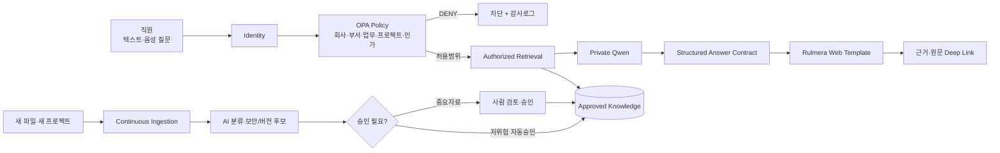
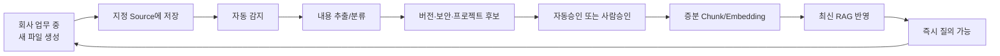
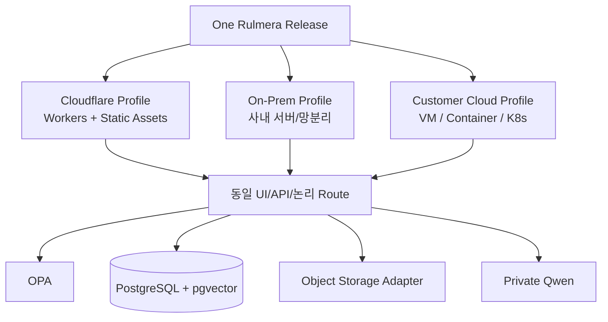
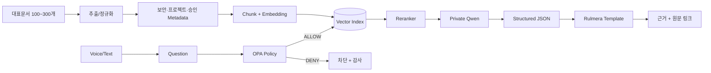

# Rulmera OPA Enterprise Knowledge

> [!summary] 제품 한 줄 정의
> **회사가 새 자료를 저장하면 Rulmera가 지속적으로 지식화하고, OPA가 허용한 회사 지식만 Qwen에 전달하여, 사용자가 텍스트나 음성으로 질문하면 기존 Rulmera 템플릿 안에서 답변·근거·원문 링크를 제공하는 Enterprise Knowledge OS.**

## 이번 v0.3에서 확정된 핵심

| 영역 | v0.1 | v0.3 기준 |
|---|---|---|
| Qwen 역할 | Private LLM 답변 | **답변/요약/근거 해석 엔진. 화면 HTML은 생성하지 않음** |
| 화면 | Responsive Web | **Rulmera가 템플릿·레이아웃·링크 규칙을 통제** |
| 질의 | 텍스트 중심 | **텍스트 + 음성(STT), 동일한 OPA/RAG 경로 사용** |
| 근거 | Citation 표시 | **실제 Rulmera Web 원문/문서 위치로 Deep Link** |
| 신규 지식 | 문서 업로드/동기화 | **Continuous Knowledge Ingestion: 자동감지→분류→검토→증분색인** |
| 새 프로젝트 | 수동 구성 가정 | **Project Candidate 자동 감지 + 관리자 승인 후 등록** |
| 재학습 | RAG 우선 | **새 사실은 Qwen 재학습이 아니라 증분 RAG 갱신** |
| 배포 | On-Prem PoC 중심 | **One Release → Cloudflare / On-Prem / Customer Cloud** |
| 저장소 | Local/MinIO | **논리 Storage Adapter로 R2/S3/On-Prem 교체 가능** |
| DB | PostgreSQL+pgvector | **배포처와 무관하게 핵심 정본 DB 계약 유지** |

## 제품의 핵심 경계



> [!important] 가장 중요한 원칙
> **Qwen이 화면을 만드는 것이 아니다.** Qwen은 정해진 응답 데이터만 반환하고, Rulmera가 항상 같은 템플릿·카드·근거패널·URL 규칙으로 렌더링한다.

## Qwen과 Rulmera의 역할 분리

```text
Template / Navigation / Cards / Deep Link  = Rulmera
Identity / Authorization                   = OPA + Rulmera
Knowledge Source / Approval / Version      = Rulmera Knowledge Layer
Retrieval / Rerank                         = Rulmera RAG
Reasoning / Natural Language Answer        = Qwen
Voice                                      = STT → 동일 질의 API
Evidence                                   = Citation → Logical Route → 실제 원문
```

## “한 번 학습하고 끝”이 아닌 이유

회사는 계속 프로젝트를 수행한다. 따라서 제품은 구축 시점의 문서를 모델 Weight에 넣고 끝나는 방식이 아니라 다음 순환을 계속 수행해야 한다.



**원칙: 사실은 RAG로, 습관은 Fine-tuning으로.**

## Deployment Fabric

하나의 제품 릴리스를 배포환경 때문에 다시 개발하지 않는다.



> [!note]
> 목표는 **Cloudflare 자체를 사내에 복제하는 것**이 아니다. Cloudflare의 전세계 Edge/CDN/DDoS 관리서비스까지 재현하지 않고, **Rulmera 기능·URL·API·스토리지 계약·템플릿의 이식성**을 표준화한다.

## 프로젝트 책임
- **총괄 / PM / 제품책임 / 전체 개발:** 룰메라팀 **윤석훈 팀장**
- **마케팅·영업:** 룰메라팀 **김일형 / 코이넷 대표**
- **PoC 고객 기술책임자:** 미정 — 자료 제공, 사실 검증, 지식 승인, 현장 인수 역할

## 기준선
- 기획 기준: `Rulmera_OPA_Enterprise_Knowledge_기획안_남동공단_20260915.pptx`
- 추가 제품기준: 2026-09-16 Continuous Knowledge / Qwen UI Contract / Deployment Fabric 결정
- 전체 목표 일정: **2026-09-16 ~ 2027-03-15, 약 6개월**
- GPU 기준: **NVIDIA RTX A6000 48GB**
- LLM: **Qwen 20~30B급을 1차 목표**로 하되 실제 A6000 추론 벤치 후 확정
- 사실지식: **RAG 우선**
- Fine-tuning: 말투·응답형식·업무패턴 최적화에 제한

## 가장 빠른 검증 경로

**10영업일 Vertical Slice PoC**에서 “질문→권한→검색→Qwen→근거→웹”을 먼저 검증하고, 이후 Continuous Knowledge와 Deployment Fabric을 단계적으로 추가한다.



## 바로가기

### 프로젝트 관리
- [[00-프로젝트관리/00-PM-대시보드|PM 대시보드]]
- [[00-프로젝트관리/01-프로젝트헌장|프로젝트 헌장]]
- [[00-프로젝트관리/06-요구사항추적표|요구사항 추적표]]
- [[00-프로젝트관리/07-범위-WBS|WBS]]
- [[00-프로젝트관리/11-의사결정로그|의사결정 로그]]
- [[00-프로젝트관리/13-변경로그|변경 로그]]

### 요구사항
- [[10-요구사항/01-제품-요구사항|제품 요구사항]]
- [[10-요구사항/03-UI-UX-요구사항|UI/UX 요구사항]]
- [[10-요구사항/04-보안-권한-요구사항|보안·권한 요구사항]]
- [[10-요구사항/05-배포-이식성-요구사항|배포·이식성 요구사항]]

### 핵심 설계
- [[20-설계/01-전체-아키텍처|전체 아키텍처]]
- [[20-설계/02-RAG-지식파이프라인|RAG·지식 파이프라인]]
- [[20-설계/03-OPA-권한모델|OPA 권한모델]]
- [[20-설계/04-클라이언트-UI-설계|공통 UI]]
- [[20-설계/07-지속-지식흡수-운영설계|Continuous Knowledge]]
- [[20-설계/08-Rulmera-Deployment-Fabric|Deployment Fabric]]
- [[20-설계/09-Qwen-응답계약-근거링크|Qwen 응답계약·근거링크]]

### 시험·운영
- [[40-시험-검증/01-PoC-검증계획|PoC 검증계획]]
- [[40-시험-검증/04-배포-동등성-시험|배포 동등성 시험]]
- [[50-배포-운영/01-배포-운영계획|배포·운영계획]]
- [[50-배포-운영/03-배포-프로파일-표준|배포 프로파일 표준]]

## 작업 원칙
1. 사실/근거/결정/변경을 문서로 남긴다.
2. 권한은 LLM 프롬프트가 아니라 **OPA가 Retrieval 전에 판정**한다.
3. Qwen에는 금지자료를 전달하지 않는다.
4. Qwen은 UI를 생성하지 않고 **Rulmera Answer Contract**만 반환한다.
5. 새 사실은 모델 재학습보다 **Continuous RAG 갱신**으로 반영한다.
6. 중요 지식은 사람이 최종 승인한다.
7. 폴더 위치만 신뢰하지 않고 문서 내용 자체로 보안/프로젝트 후보를 재검증한다.
8. 논리 URL/Route ID를 사용해 Cloudflare·On-Prem 어디에서도 근거 링크가 깨지지 않게 한다.
9. **Build Once, Deploy Anywhere**를 배포 원칙으로 한다.
10. Cloudflare 종속 기능을 핵심 도메인 로직과 분리한다.
