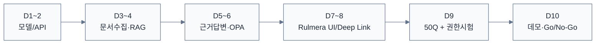

# Rulmera OPA Enterprise Knowledge PM 대시보드 v0.5

> [!summary]
> 이 문서는 프로젝트 관리 기준, 책임, 일정, 통제 절차를 정리한 관리 문서다.

> [!info]
> 표기 기준: 전문 용어는 가능하면 `원어(알기 쉬운 설명)` 형식을 사용하고, 공통 기준은 [[20-설계/00-용어-스타일-가이드]]를 따른다.

## 현재 상태
- 전체 진행률: **8% — v0.3 제품/아키텍처 기준선 마이그레이션**
- 현재 단계: **착수 + 10영업일 PoC 준비**
- 전체 기준 일정: **2026-09-16 ~ 2027-03-15**
- 다음 개발 게이트: **M-002 Vertical Slice PoC**
- 총괄/개발: **윤석훈 팀장**
- 마케팅/영업: **김일형(코이넷 대표)**

## v0.3 신규 확정

| 결정 | 상태 |
|---|---|
| Qwen은 Rulmera 템플릿을 변경하지 않고 Answer Contract만 반환 | ✅ 기준선 |
| 텍스트/음성 질의는 동일 OPA/RAG 경로 | ✅ 기준선 |
| 근거는 실제 원문 Deep Link로 확인 | ✅ 기준선 |
| 신규 파일/프로젝트를 Continuous Knowledge로 자동 흡수 | ✅ 기준선 |
| 중요 지식은 사람 승인 후 정본화 | ✅ 기준선 |
| 새 사실은 반복 Fine-tuning이 아니라 증분 RAG로 갱신 | ✅ 기준선 |
| One Release → Cloudflare / On-Prem / Customer Cloud | ✅ 기준선 |
| Cloudflare 전체 복제가 아니라 Product Contract Parity | ✅ 기준선 |

## 프로젝트 건강도

| 영역 | 상태 | 현재 판단 |
|---|---|---|
| 범위 | 🟢 | 원 기획 + Continuous Knowledge + Deployment Fabric까지 제품범위 연결 |
| 일정 | 🟡 | 6개월 기준선 유지, 추가 범위는 PoC 이후 우선순위 조정 필요 |
| 인력 | 🟡 | 개발 전 과정 1인 수행이므로 Adapter/자동화 우선 |
| 데이터 | 🔴 | 실제 PoC 대상 기업과 대표문서 세트 미확정 |
| GPU | 🟡 | A6000 48GB 실제 벤치 필요 |
| UI | 🟢 | Rulmera Template + Structured Answer Contract 확정 |
| 보안 | 🟢 | OPA 선판정 + 승인정본 + 감사 원칙 확정 |
| 지식운영 | 🟢 | Continuous Ingestion/Project Candidate 설계 기준 확정 |
| 배포 | 🟢 | Cloudflare/On-Prem 추상화 경계 기술검증 완료 |
| 배포실측 | 🟡 | 실제 동일 Release Parity test는 미수행 |

## 10일 PoC 게이트

Continuous Ingestion과 Deployment Fabric은 PoC Core가 안정된 후 Alpha 단계에서 확대한다.

## 핵심 관리 문서
- [[01-프로젝트헌장]]
- [[02-프로젝트관리계획]]
- [[06-요구사항추적표]]
- [[07-범위-WBS]]
- [[08-마일스톤계획]]
- [[09-리스크등록부]]
- [[11-의사결정로그]]
- [[13-변경로그]]
- [[16-품질-인수기준]]
- [[17-산출물등록부]]

## 즉시 해야 할 일
1. PoC 기업/대체 코퍼스와 100~300개 대표문서 확정.
2. A6000 Server baseline 확인.
3. Golden 50 + 권한시험 계정/문서 매트릭스 작성.
4. Mock `Answer Contract`로 Rulmera 템플릿 UI 구현.
5. `resource_id → Deep Link` Route Resolver PoC.
6. Source folder 1개로 신규/변경 파일 증분색인 smoke test.
7. On-Prem profile을 기본으로 E2E 완성 후 Cloudflare profile parity smoke.
