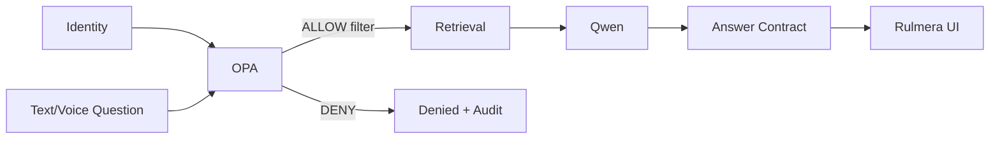

# 프로젝트관리계획 v0.3

## 1. 관리 방식
6개월 계획을 기준선으로 하되 10영업일 Vertical Slice PoC를 먼저 완성하고, 측정결과를 반영하는 짧은 반복형 개발로 수행한다.

## 2. 범위 관리
- 원 기획안의 13개 챕터를 제품 출발점으로 유지.
- v0.3 추가 범위:
  - Qwen Answer Contract
  - Voice + Deep Link
  - Continuous Knowledge
  - Project Candidate
  - Deployment Fabric
- 기능은 `REQ-*`, 결정은 `DEC-*`, 변경은 `CHG-*`로 추적.
- **클라우드별 Fork는 금지**하고 Adapter/Profile로 해결.

## 3. 일정 관리
- 전체: 2026-09-16 ~ 2027-03-15
- 1차: 10영업일 PoC
- Continuous Ingestion/Deployment Fabric은 PoC 핵심 이후 Alpha로 단계적 확대
- 고객 데이터/승인 지연은 변경 사유로 기록

## 4. 개발·형상 관리
- Frontend/Backend/Policy/Infra/Deployment manifest 모두 Git 관리
- `main`은 실행가능 상태 유지
- 릴리즈마다 `rulmera.deploy.yaml` schema version 기록
- 환경별 branch 대신 **동일 release artifact + profile**

## 5. 품질 관리
다음 축을 동시에 시험:
- 근거성
- 권한안전성
- 최신성/승인정본
- No-evidence 처리
- Deep Link
- Incremental ingestion
- Project Candidate
- UI Responsive
- Deployment Parity

## 6. 보안 관리

- Qwen이 보안판정하지 않는다.
- DENY 본문은 Context에 포함하지 않는다.
- 음성도 동일 경로.
- Source click도 권한 재검증 가능하게 설계.

## 7. 데이터 관리
- 원본은 보존.
- 추출텍스트/Chunk/Embedding은 재생성 가능.
- version/security/approval/project/owner를 필수 관리.
- Change Event 기반 증분색인.
- 삭제/권한변경은 Vector Index에 반영.
- 신규 프로젝트는 Candidate→승인→Project ID.

## 8. 지식운영 관리
- 자동분류는 후보.
- 중요자료 사람승인.
- 저위험 자료는 Tenant Policy로 자동승인 가능.
- 오분류/상향보안 후보는 관리자 Inbox에 노출.
- 자동판단/수정/승인 이력은 감사 가능.

## 9. 배포 관리
- On-Prem을 기본 Private 기준으로 둔다.
- Cloudflare-assisted와 Customer Cloud를 Profile로 제공.
- Core DB는 PostgreSQL+pgvector 유지.
- Object는 S3-compatible Adapter.
- Cloudflare 전용 로직은 Adapter에 격리.
- Parity test를 릴리즈 Gate로 둔다.

## 10. 리스크 관리
[[09-리스크등록부]] 기준.

## 11. UI 개발 원칙
- Rulmera가 화면 소유.
- Qwen은 Answer Contract만 반환.
- Citation은 logical resource ID.
- Domain/Base URL은 배포 profile에서 해결.
- Web/PWA/Android 동일 코드베이스.
