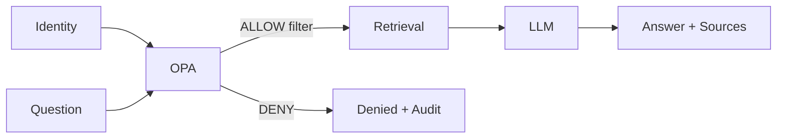

# 프로젝트관리계획

## 1. 관리 방식
본 프로젝트는 6개월 계획을 기준선으로 하되, 10영업일 PoC를 먼저 완성한 후 측정 결과를 반영하는 **짧은 반복형 개발**로 수행한다. 총괄과 개발 전 과정을 윤석훈 팀장이 수행하므로, 문서 자체가 의사결정과 변경 이력을 대신할 수 있도록 Obsidian 기준선을 유지한다.

## 2. 범위 관리
- 제품 범위 기준: 기획안의 13개 챕터 + 요구사항 추적표.
- 요구사항 추가/변경은 `REQ-*`로 등록한다.
- 2일 이상 추가 작업이 예상되거나 핵심 아키텍처에 영향을 주면 `CHG-*` 변경요청으로 승격한다.
- 신규 기능보다 권한 안전성·근거성·정본화를 우선한다.

## 3. 일정 관리
- 전체 기준: 2026-09-16 ~ 2027-03-15.
- 1차 게이트: 착수 후 10영업일 Vertical Slice PoC.
- 2주 단위 내부 반복을 기본으로 하며 매 반복 종료 때 실행 가능한 화면을 확인한다.
- 고객 데이터/승인 지연은 일정 변경 사유로 기록한다.

## 4. 개발·형상 관리
- Frontend/Backend/Policy/Infra를 Git으로 관리한다.
- `main`은 항상 실행 가능한 상태를 지향한다.
- 중요 기능은 요구사항 ID와 커밋/릴리즈 노트를 연결한다.
- PoC 이후 릴리즈 태그: `v0.1-poc`, `v0.2-alpha`, `v0.5-pilot`, `v1.0` 후보.

## 5. 품질 관리
- RAG 정답성만 보지 않고 **근거성·권한안전성·모름처리·버전충돌·UI 반응형**을 동시에 시험한다.
- 골든 Q&A 평가셋을 최소 50문항으로 시작해 지속 확장한다.
- OPA 정책은 자동 Allow/Deny 회귀시험을 반드시 둔다.
- 실제 고객 문서가 없을 때는 의도적으로 L0~L5가 섞인 테스트 코퍼스로 보안 누출을 먼저 검증한다.

## 6. 보안 관리

- LLM이 보안판정을 하지 않는다.
- DENY 자료의 본문은 LLM Context에 포함하지 않는다.
- 모든 검색/질의/다운로드/거부 이벤트는 감사로그에 남긴다.

## 7. 데이터 관리
- 원본 파일은 변경하지 않고 보관한다.
- 추출텍스트·Chunk·Embedding은 재생성 가능 산출물로 관리한다.
- 문서 버전, 승인상태, 보안등급, 유효일, 소유자를 필수 메타데이터로 둔다.
- 삭제/권한변경 시 Vector Index에도 반영되는 재색인 절차를 둔다.

## 8. 커뮤니케이션
- 윤석훈: 개발/PM 문서와 실행 화면을 기준으로 상시 업데이트.
- 김일형: 고객 요구, 영업 피드백, PoC 후보기업 정보를 주간 공유.
- PoC 고객: 자료목록/권한정책/정답질문/승인 결과를 단계별 확인.

## 9. 리스크 관리
- 주요 리스크는 [[09-리스크등록부]]에서 확률/영향/대응으로 관리한다.
- 최우선 리스크: 데이터 미확보, 1인 개발 병목, A6000 추론성능, 권한 누출, 고객별 정책 복잡도.

## 10. 조달 관리
- A6000 보유/재사용 여부를 먼저 확인한다.
- 부족하면 RAM 128GB+, NVMe 4TB+, UPS, 백업 스토리지를 우선 구매한다.
- 신규 GPU 구매는 실제 PoC TPS/Latency 측정 후 결정한다.

## 11. UI 개발 원칙
- 하나의 React/TypeScript Responsive Frontend.
- Windows에서는 브라우저로 즉시 확인.
- Android에서는 동일 빌드를 Capacitor로 감싸 앱화.
- Mobile 전용 별도 화면을 만들지 않고 Layout component만 breakpoint에 따라 변화한다.
