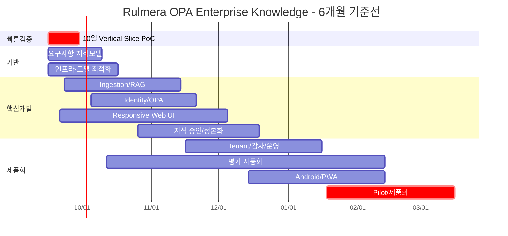

# 범위·WBS

## WBS 기준선 v0.1
| WBS | 작업 | 산출물 | 담당 | 시작 | 종료 | 진행률 | 상태 |
|---|---|---|---|---|---|---:|---|
| 1.0 | 프로젝트 관리/PMBOK | 헌장·WBS·리스크·요구사항 | 윤석훈 | 2026-09-16 | 2027-03-15 | 15 | 진행 |
| 2.0 | 10일 Vertical Slice PoC | E2E 데모 | 윤석훈 | 2026-09-16 | 2026-09-29 | 0 | 계획 |
| 2.1 | A6000/모델 API 기동 | LLM API | 윤석훈 | 2026-09-16 | 2026-09-18 | 0 | 계획 |
| 2.2 | 샘플문서 수집·색인 | 100~300문서 Index | 윤석훈 | 2026-09-17 | 2026-09-21 | 0 | 계획 |
| 2.3 | RAG 근거답변 | Citation Chat | 윤석훈 | 2026-09-21 | 2026-09-23 | 0 | 계획 |
| 2.4 | OPA L0~L5 차단 | Policy Demo | 윤석훈 | 2026-09-22 | 2026-09-24 | 0 | 계획 |
| 2.5 | Responsive UI | Desktop/Mobile 동일 UI | 윤석훈 | 2026-09-21 | 2026-09-25 | 0 | 계획 |
| 2.6 | 50문항+권한 시험 | PoC 시험결과 | 윤석훈 | 2026-09-25 | 2026-09-29 | 0 | 계획 |
| 3.0 | 요구사항·지식모델 정제 | 요구사항/Metadata v1 | 윤석훈 | 2026-09-16 | 2026-10-09 | 10 | 진행 |
| 4.0 | 인프라·모델 최적화 | Model/Serving Baseline | 윤석훈 | 2026-09-16 | 2026-10-16 | 0 | 계획 |
| 5.0 | 데이터 Ingestion/RAG | 수집·정규화·검색·Rerank | 윤석훈 | 2026-09-23 | 2026-11-13 | 0 | 계획 |
| 6.0 | Identity/OPA 권한 | Policy/ACL/Audit | 윤석훈 | 2026-10-05 | 2026-11-20 | 0 | 계획 |
| 7.0 | 공통 Web UI | 사용자/관리자 Responsive UI | 윤석훈 | 2026-09-21 | 2026-12-04 | 0 | 계획 |
| 8.0 | 지식 승인/정본화 | Expert Notes/Approval | 윤석훈 | 2026-10-26 | 2026-12-18 | 0 | 계획 |
| 9.0 | Tenant/감사/운영 | 격리·감사·백업 | 윤석훈 | 2026-11-16 | 2027-01-15 | 0 | 계획 |
| 10.0 | 품질·평가 자동화 | Golden Set/회귀시험 | 윤석훈 | 2026-10-12 | 2027-02-12 | 0 | 계획 |
| 11.0 | Android/PWA | Capacitor Android 패키지 | 윤석훈 | 2026-12-14 | 2027-02-12 | 0 | 계획 |
| 12.0 | Pilot 운영/제품화 | 고객 PoC/패키지/매뉴얼 | 윤석훈 | 2027-01-18 | 2027-03-15 | 0 | 계획 |
| 13.0 | 마케팅·영업 | PoC 대상 발굴/제안 | 김일형 | 2026-09-16 | 2027-03-15 | 5 | 진행 |

## 일정 시각화

