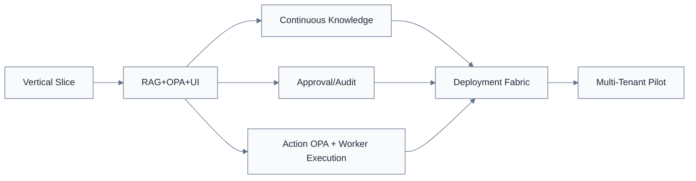

# 범위·WBS v0.9

> [!summary]
> 이 문서는 프로젝트 관리 기준, 책임, 일정, 통제 절차를 정리한 관리 문서다.

> [!info]
> 표기 기준: 전문 용어는 가능하면 `원어(알기 쉬운 설명)` 형식을 사용하고, 공통 기준은 [[20-설계/00-용어-스타일-가이드]]를 따른다.

## WBS 기준선 v0.3

| WBS | 작업 | 산출물 | 담당 | 종료 목표 | 상태 |
|---|---|---|---|---|---|
| 1.0 | 프로젝트 관리/PMBOK | 헌장·WBS·리스크·요구사항 | 윤석훈 | 2027-03-15 | 진행 |
| 2.0 | 10일 Vertical Slice PoC | E2E 데모 | 윤석훈 | 2026-09-29 | 계획 |
| 2.1 | A6000/Qwen API | LLM Streaming API | 윤석훈 | 2026-09-18 | 계획 |
| 2.2 | 샘플문서 수집·색인 | 100~300 Index | 윤석훈 | 2026-09-21 | 계획 |
| 2.3 | RAG + Citation | 근거답변 | 윤석훈 | 2026-09-23 | 계획 |
| 2.4 | OPA L0~L5 | Policy Demo | 윤석훈 | 2026-09-24 | 계획 |
| 2.5 | Rulmera UI + Answer Contract | 고정 템플릿 UI | 윤석훈 | 2026-09-25 | 계획 |
| 2.6 | Deep Link + Voice smoke | 링크/STT | 윤석훈 | 2026-09-26 | 계획 |
| 2.7 | 50Q+권한 시험 | PoC 결과 | 윤석훈 | 2026-09-29 | 계획 |
| 3.0 | 요구사항·지식모델 | Metadata/Schema | 윤석훈 | 2026-10-09 | 진행 |
| 4.0 | 인프라·모델 최적화 | Serving Baseline | 윤석훈 | 2026-10-16 | 계획 |
| 5.0 | Continuous Ingestion/RAG | Watcher·분류·증분색인 | 윤석훈 | 2026-11-20 | 계획 |
| 5.1 | Source Watcher | create/update/delete event | 윤석훈 | 2026-10-23 | 계획 |
| 5.2 | AI Metadata 분류 | project/security/version 후보 | 윤석훈 | 2026-11-06 | 계획 |
| 5.3 | Project Candidate | 신규프로젝트 등록 workflow | 윤석훈 | 2026-11-13 | 계획 |
| 5.4 | Incremental Index | 변경분 upsert/delete | 윤석훈 | 2026-11-20 | 계획 |
| 6.0 | Identity/OPA/Audit/Action Worker | Policy/ACL/Audit/Worker 실행통제 | 윤석훈 | 2026-12-11 | 계획 |
| 6.1 | Action OPA | Tool/Resource/Argument/환경 정책 | 윤석훈 | 2026-11-06 | 계획 |
| 6.2 | Worker Controller / PEP | Job 정규화·OPA 집행·라우팅 | 윤석훈 | 2026-11-13 | 계획 |
| 6.3 | Execution Worker | 문서/코드/테스트 실행 Worker | 윤석훈 | 2026-11-20 | 계획 |
| 6.4 | Job/Result Contract | Qwen↔Worker 구조화 계약 | 윤석훈 | 2026-11-20 | 계획 |
| 6.5 | Action Audit/Approval Gate | 고위험 실행 승인·감사 | 윤석훈 | 2026-11-27 | 계획 |
| 6.6 | PEP/PDP 실행통제 | Controller 정규화 + OPA Tool/Resource/Argument 판정 | 윤석훈 | 2026-11-27 | 계획 |
| 6.7 | Job Hash Approval Binding | 승인 Job 불변성·만료·재검증 | 윤석훈 | 2026-12-04 | 계획 |
| 6.8 | Durable Workflow | 상태 영속·Retry·Timeout·장애복구 Adapter | 윤석훈 | 2026-12-11 | 계획 |
| 7.0 | 공통 Web UI | 사용자/관리자 Responsive UI | 윤석훈 | 2026-12-04 | 계획 |
| 8.0 | 지식 승인/정본화 | Expert Notes/Approval | 윤석훈 | 2026-12-18 | 계획 |
| 9.0 | Deployment Fabric | Cloudflare/On-Prem/Customer Cloud | 윤석훈 | 2027-01-15 | 계획 |
| 9.1 | Logical Route/Manifest | 공통계약 | 윤석훈 | 2026-12-11 | 계획 |
| 9.2 | On-Prem Profile | Private 패키지 | 윤석훈 | 2026-12-24 | 계획 |
| 9.3 | Cloudflare Profile | Worker/Static Assets adapter | 윤석훈 | 2027-01-08 | 계획 |
| 9.4 | Parity Suite | 동일 기능 회귀시험 | 윤석훈 | 2027-01-15 | 계획 |
| 10.0 | Tenant/운영 | 격리·백업·운영 | 윤석훈 | 2027-01-22 | 계획 |
| 11.0 | 품질·평가 자동화 | Golden/보안/Parity | 윤석훈 | 2027-02-12 | 계획 |
| 12.0 | Android/PWA | Capacitor package | 윤석훈 | 2027-02-12 | 계획 |
| 13.0 | Pilot/제품화 | 고객 Pilot/매뉴얼 | 윤석훈 | 2027-03-15 | 계획 |
| 14.0 | 마케팅·영업 | PoC 대상/제안 | 김일형 | 2027-03-15 | 진행 |

## 구조

