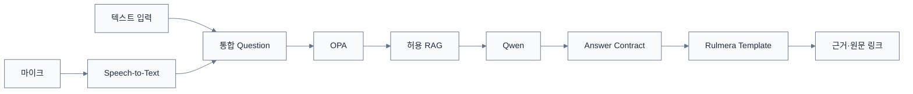

# 제품 요구사항 v0.5

> [!summary]
> 이 문서는 제품이 반드시 충족해야 할 기능·비기능 요구를 정리한 요구 기준 문서다.

> [!info]
> 표기 기준: 전문 용어는 가능하면 `원어(알기 쉬운 설명)` 형식을 사용하고, 공통 기준은 [[20-설계/00-용어-스타일-가이드]]를 따른다.

## 제품 정의

**Rulmera OPA Enterprise Knowledge**는 단순 사내 검색기나 Qwen 챗봇이 아니다.

> **지식의 수집 → 자동분류 → 검토/승인 → 정본화 → 권한판정 → 검색 → Qwen 답변 → 근거/원문 확인 → 감사 → 지속 갱신**을 하나의 흐름으로 제공하는 Enterprise Knowledge OS.

## 제품이 반드시 지켜야 할 5가지

1. **Qwen은 화면을 만들지 않는다.**  
   Rulmera가 템플릿·메뉴·카드·링크를 통제하고 Qwen은 구조화된 답변 데이터만 반환한다.

2. **권한이 먼저다.**  
   OPA가 허용하지 않은 자료는 검색에도, Qwen Context에도 들어가지 않는다.

3. **회사는 계속 변한다.**  
   신규 프로젝트·문서·개정본을 자동 감지하고 증분 RAG로 계속 반영한다.

4. **답변은 원문으로 돌아갈 수 있어야 한다.**  
   Citation은 실제 문서/페이지/노트로 이동하는 Rulmera Deep Link를 가진다.

5. **배포처가 제품을 바꾸지 않는다.**  
   Cloudflare, On-Prem, Customer Cloud에서 동일 기능/URL/API 계약을 유지한다.

## 사용자 기능

| 기능 | 설명 |
|---|---|
| **Ask Company** | 텍스트/음성으로 회사 AI 질의 |
| **Knowledge** | 문서/지식 검색, 원문, 버전, 정본 확인 |
| **Expert Notes** | 숙련자 노하우/장애사례/FAQ 등록 |
| **Approval** | 후보지식·자동분류 결과 검토/승인 |
| **Access Policy** | L0~L5 + 조직/업무/프로젝트/NDA/기간 정책 |
| **Audit** | 질문/검색/다운로드/DENY 이력 |
| **Knowledge Health** | 승인/검토/충돌/출처불명/색인 상태 |
| **Knowledge Inbox** | 새로 들어온 파일·개정본·프로젝트 후보 확인 |
| **Deployment Health** | Cloudflare/On-Prem 등 현재 배포 프로파일 및 서비스 상태 |

## 질의 경험

## 사용자 유형

- K0 신입: 쉬운 용어와 단계별 설명
- K1 작업자
- K2 숙련자
- K3 엔지니어
- K4+ 책임자: 전문 파라미터/근거 중심

보안등급(L0~L5)과 전문설명수준(K0~K4)은 **서로 다른 축**으로 관리한다.

## 관리기능

- Source Connector / 수집폴더 관리
- 신규 파일 자동 감지
- Metadata 자동분류 후보
- 보안등급/프로젝트/문서종류/버전 후보
- 신규 Project Candidate
- 승인대기함
- 증분 색인/Re-index 상태
- Policy 테스트
- 평가셋 관리
- 모델/색인 상태
- 감사검색
- Tenant 관리
- Deployment Profile 관리

## 지식 갱신 원칙

### 모델을 매번 다시 학습시키지 않는다
새 프로젝트의 사실, 새 매뉴얼, 최신 장애사례는 RAG에 증분 반영한다.

### Fine-tuning은 제한적으로 사용
- 사내 보고서 문체
- 응답 JSON/Tool 패턴
- 반복 업무 분류
- 특정 답변 스타일

기밀 사실을 모델 Weight에 기억시키는 수단으로 사용하지 않는다.

## 승인 원칙

| 자료 | 기본 처리 |
|---|---|
| 공개/사내 일반자료 | 정책에 따라 자동승인 가능 |
| 일반 업무절차 | 자동분류 후 샘플 검수 가능 |
| PLC/소스/도면/핵심기술 | 사람 승인 필수 |
| NDA/원가/특허前/고객기밀 | 고등급 승인 + 감사 강화 |
| 신규 프로젝트 최초 자료 | Project Candidate 확인 후 연결 |

> [!warning]
> 폴더가 `일반자료`라고 해서 L1로 확정하지 않는다. 내용분석에서 고객명·NDA·회로·원가·소스 등이 검출되면 상향 보안등급 후보를 생성한다.
