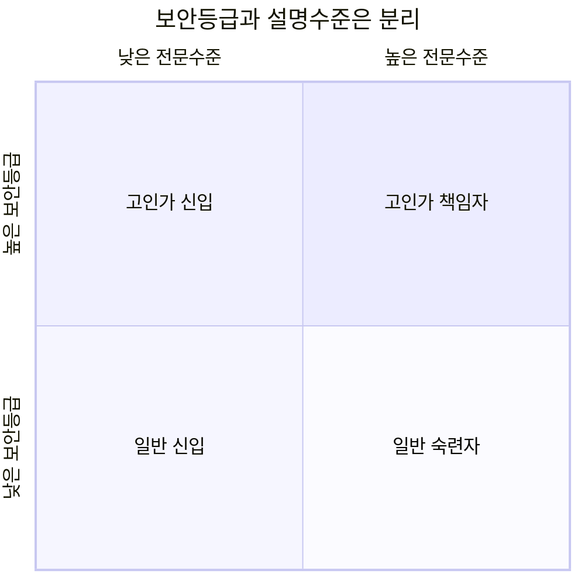

# 제품 요구사항 v0.1

## 제품 정의
Rulmera OPA Enterprise Knowledge는 단순 사내 검색기가 아니라 **지식의 수집 → 검토 → 승인 → 정본화 → 권한판정 → 검색 → 근거답변 → 감사**를 하나의 흐름으로 제공하는 Enterprise Knowledge OS를 목표로 한다.

## 사용자 기능
1. **Ask Company** — 회사 AI 질의/대화
2. **Knowledge** — 문서/지식 검색, 원문, 버전, 정본 확인
3. **Expert Notes** — 숙련자 노하우/장애사례/FAQ 등록
4. **Approval** — 후보지식 검토/승인
5. **Access Policy** — L0~L5 및 조직/프로젝트 기반 정책
6. **Audit** — 질문/검색/다운로드/DENY 이력
7. **Knowledge Health** — 승인정본/검토필요/충돌/출처불명 현황

## 사용자 유형
- K0 신입: 쉬운 용어와 단계별 설명
- K1 작업자
- K2 숙련자
- K3 엔지니어
- K4+ 책임자: 전문 파라미터/근거 중심

보안등급(L0~L5)과 전문설명수준(K0~K4)은 **서로 다른 축**으로 관리한다.

## 관리기능
- 문서 업로드/동기화
- Metadata 편집/일괄분류
- 승인대기함
- Policy 테스트
- 평가셋 관리
- 모델/색인 상태
- 감사검색
- Tenant 관리
