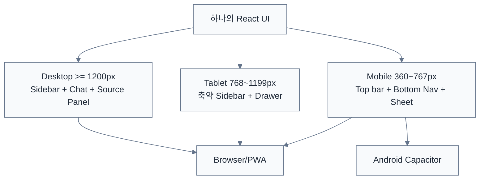

# UI/UX 요구사항 — Desktop/Web/Android 공통 v0.5

> [!summary]
> 이 문서는 제품이 반드시 충족해야 할 기능·비기능 요구를 정리한 요구 기준 문서다.

> [!info]
> 표기 기준: 전문 용어는 가능하면 `원어(알기 쉬운 설명)` 형식을 사용하고, 공통 기준은 [[20-설계/00-용어-스타일-가이드]]를 따른다.

## 핵심 원칙

> **Qwen이 UI를 만들지 않는다. Rulmera가 UI를 소유한다.**

하나의 React/TypeScript UI를 반응형으로 만들고 Web/PWA/Android에서 재사용한다.  
Qwen은 답변 HTML을 생성하지 않고, Rulmera가 정한 Answer Contract(JSON)를 반환한다.

## 주요 화면

- 로그인/Tenant 선택
- **Ask Company — 텍스트 + 음성**
- 답변 근거 Drawer/Sheet
- Knowledge 검색/문서 보기
- Expert Notes 등록
- **Knowledge Inbox — 신규파일/버전/프로젝트 후보**
- Approval Inbox
- Access Policy
- Audit
- Knowledge Health/Admin
- Deployment Health

## Ask Company 답변 카드

```text
┌──────────────────────────────────────────────────┐
│ 질문: A2 Pilot DO가 계속 높은 이유가 뭐야?      │
├──────────────────────────────────────────────────┤
│ Rulmera OPA 답변                                 │
│ 1. 우선 송풍기 운전 주파수를 확인합니다.         │
│ 2. DO 센서 상태와 최근 보정이력을 확인합니다.    │
│ 3. PLC 자동제어 조건을 확인합니다.               │
│                                                  │
│ [근거 3건] [승인본] [인가 L3] [주의 없음]        │
├──────────────────────────────────────────────────┤
│ ① M203 송풍기 제어.md          [원문 보기 →]     │
│ ② 장애사례-2026-004.md         [사례 보기 →]     │
│ ③ PLC Control Rev.4 p.17       [해당 위치 →]     │
└──────────────────────────────────────────────────┘
```

## Deep Link 규칙

표시 URL을 Qwen이 직접 조합하지 않는다.

```text
Qwen/Citation
  → resource_id + locator
  → Rulmera Route Resolver
  → /knowledge/{tenant}/{doc}/{version}?loc=...
```

이렇게 해야 Cloudflare와 On-Prem의 도메인이 달라도 답변 링크가 유지된다.

## 음성 UX

- 마이크 버튼 누름
- STT 결과를 입력창에 보여줌
- 사용자가 수정 가능
- 전송 후에는 텍스트 질의와 **완전히 동일한 OPA/RAG 경로**
- 필요 시 향후 TTS 답변을 별도 옵션으로 추가
- 음성이라고 권한 경로를 우회하지 않는다.

## 반응형 Layout



## Desktop
- 좌측: 대화/메뉴 Sidebar
- 중앙: Chat/Knowledge
- 우측: 출처/문서 상세 Panel
- 관리자: Inbox/Approval/Policy를 Split View로 제공 가능

## Mobile
- 중앙 Chat을 가장 넓게 유지
- 메뉴는 Drawer/Bottom Navigation
- 출처는 Bottom Sheet
- 긴 표/코드는 제한된 가로스크롤
- 음성 입력은 하단 입력바에서 한 손 접근 가능

## UI 개발 원칙
1. Backend 없이 Mock Answer Contract로 화면 Shell 완성
2. Chat streaming API 연결
3. Citation/Deep Link 연결
4. STT 연결
5. Login/Identity/OPA 상태 표시
6. Knowledge Inbox/Approval 추가
7. Deployment Profile에 상관없이 동일 UI E2E 시험
8. Capacitor Android build
