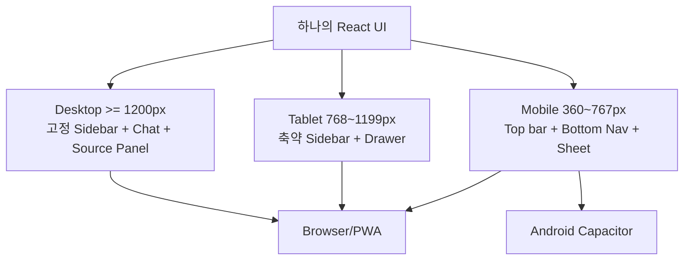

# UI/UX 요구사항 — Desktop/Web/Android 공통

## 핵심 원칙
**화면을 두 개 만들지 않는다.** 하나의 React/TypeScript UI를 반응형으로 만들고 Web/PWA/Android에서 그대로 사용한다.

## 주요 화면
- 로그인/Tenant 선택
- Ask Company Chat
- 답변 근거 Drawer/Sheet
- Knowledge 검색/문서 보기
- Expert Notes 등록
- Approval Inbox
- Access Policy
- Audit
- Knowledge Health/Admin

## 반응형 Layout

## Desktop
- 좌측: 대화/메뉴 Sidebar
- 중앙: Chat/Knowledge
- 우측: 출처/문서 상세 Panel을 필요 시 고정

## Mobile
- 중앙 Chat을 가장 넓게 유지
- 메뉴는 Drawer 또는 Bottom Navigation
- 출처는 Bottom Sheet
- 표/정책 편집은 카드/Accordion 형태로 재배치
- 긴 코드/표는 가로 스크롤 영역을 제한적으로 허용

## 매일 확인할 Viewport
- 360×800
- 412×915
- 768×1024
- 1440×900
- 실제 Android 기기 1대 이상

## UI 개발 순서
1. Backend 없이 Mock JSON으로 화면 Shell 완성
2. Chat streaming API 연결
3. Source panel 연결
4. Login/Identity/OPA 상태 표시
5. Admin 기능 추가
6. Capacitor Android build
