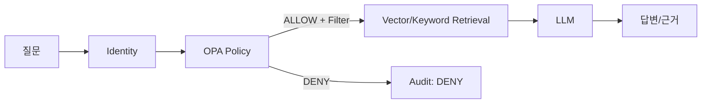

# 보안·권한 요구사항

## 보안등급
- L0 공개
- L1 사내
- L2 부서
- L3 기술
- L4 핵심기술
- L5 최고기밀

## 권한 속성
- tenant/company
- department
- role/title
- job_scope
- project membership
- clearance L0~L5
- NDA/customer
- valid period
- employment status

## 핵심 규칙

### 절대 원칙
- `DENY` 문서 본문은 LLM에 전달하지 않는다.
- Tenant filter는 모든 검색의 필수조건이다.
- 미분류 자료는 기본 `DENY` 또는 관리자 전용이다.
- 승인되지 않은 후보지식은 일반 사용자 RAG에서 제외한다.
- 사용자 권한 변경은 다음 질의부터 즉시 반영한다.
