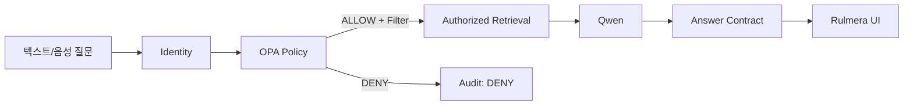

# 보안·권한 요구사항 v0.3

## 보안등급
- L0 공개
- L1 사내
- L2 부서
- L3 기술
- L4 핵심기술
- L5 최고기밀

## 권한 속성
- tenant/company
- department
- role/title
- job_scope
- project membership
- clearance L0~L5
- NDA/customer
- valid period
- employment status

## 핵심 흐름

## 절대 원칙
- `DENY` 문서 본문은 Qwen에 전달하지 않는다.
- Tenant filter는 모든 검색의 필수조건.
- 미분류 자료는 Default DENY 또는 관리자 전용.
- 승인되지 않은 고위험 후보지식은 일반 RAG 제외.
- 사용자 권한변경은 다음 질의부터 반영.
- 음성질문은 별도 권한경로를 만들지 않는다.
- Citation 원문 클릭 시에도 현재 사용자 권한을 재검증할 수 있어야 한다.
- 자동분류가 낮은 등급을 제안하더라도 내용위험 신호가 있으면 상향 후보를 우선한다.

## Ingestion 보안
- Source 폴더명만 보고 등급 확정 금지
- 신규 프로젝트 최초 문서는 자동 공개 금지
- Auto-approval은 허용목록 기반
- 보안분류 override는 감사로그 기록
