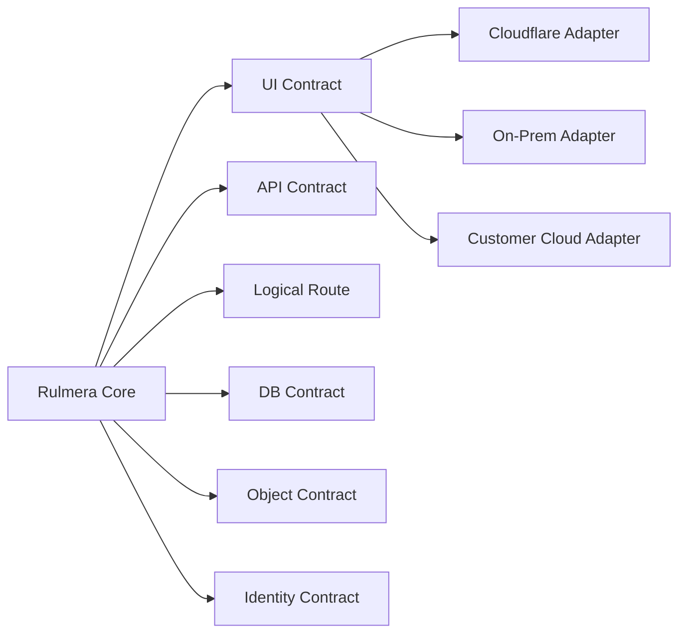

# 배포·이식성 요구사항 v0.3

## 목표

> **One Rulmera Release → Cloudflare / On-Prem / Customer Cloud**

제품 소스와 사용자 경험은 동일하게 유지하고, 인프라 차이는 Adapter/Profile에서 흡수한다.

## 요구사항

| ID | 요구사항 | 우선순위 |
|---|---|---|
| REQ-DEP-001 | 동일 Frontend Build를 Cloudflare와 On-Prem에서 배포 가능해야 한다. | MUST |
| REQ-DEP-002 | `/api/*`, `/knowledge/*` 등 논리 Route 계약을 배포처와 무관하게 유지한다. | MUST |
| REQ-DEP-003 | 근거 링크는 절대 URL 대신 logical resource ID로 생성해야 한다. | MUST |
| REQ-DEP-004 | Object Storage는 S3-compatible Adapter로 추상화한다. | MUST |
| REQ-DEP-005 | 핵심 정본 DB는 PostgreSQL+pgvector 계약을 유지한다. | MUST |
| REQ-DEP-006 | Cloudflare 전용 기능은 Domain/Core와 분리하고 Adapter 내부에 둔다. | MUST |
| REQ-DEP-007 | On-Prem은 외부 인터넷 없이 설치/운영 가능한 Full Private 모드를 지원한다. | MUST |
| REQ-DEP-008 | 동일 시험셋으로 Cloudflare/On-Prem 기능 Parity를 검사한다. | MUST |
| REQ-DEP-009 | 배포 프로파일은 선언형 Manifest로 선택 가능해야 한다. | SHOULD |
| REQ-DEP-010 | 설치·업그레이드·Rollback을 프로파일별 Runbook으로 제공한다. | MUST |

## 하지 않는 것

- Cloudflare의 전세계 Edge Network를 사내에서 복제
- Cloudflare DDoS/Anycast/CDN 운영체계를 자체 구현
- Cloudflare D1을 PostgreSQL+pgvector의 필수 대체재로 사용
- 플랫폼마다 별도 제품 Fork 생성

## 표준화 대상

