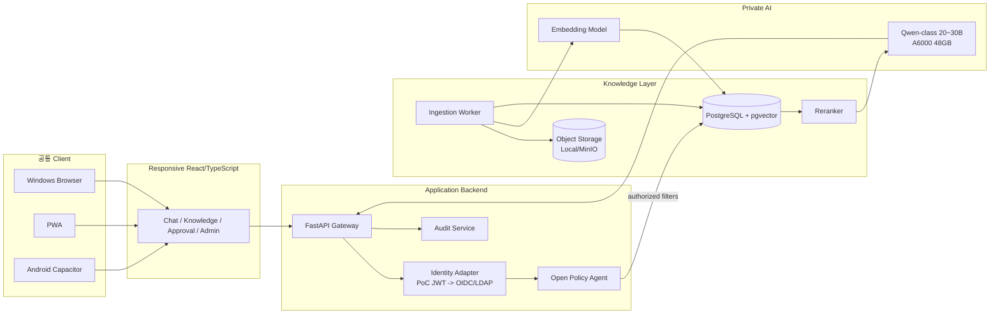

# 전체 아키텍처 v0.1

## 목표 구조

## 빠른 구현을 위한 기술선택
- Frontend: React + TypeScript + Vite + PWA
- Android: Capacitor
- Backend: Python FastAPI
- Policy: Open Policy Agent (Rego)
- DB: PostgreSQL + pgvector
- Object: PoC local filesystem, 이후 MinIO/S3-compatible
- Model serving: vLLM/SGLang/llama.cpp 계열을 실제 A6000 벤치로 선택
- Streaming: SSE 우선
- Container: Docker Compose로 PoC 단순화

## 왜 이 구조인가
- AI/RAG 라이브러리는 Python 생태계가 빠르다.
- React UI 하나로 Windows/Web/Android를 모두 확인할 수 있다.
- OPA를 별도 정책경계로 둬 LLM과 보안을 분리한다.
- PostgreSQL+pgvector로 초기 구성요소를 줄이고, 규모가 커지면 Vector Store를 교체한다.
