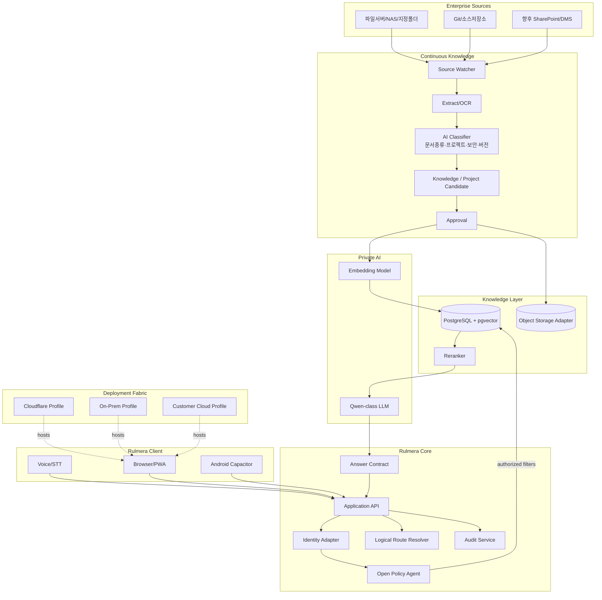
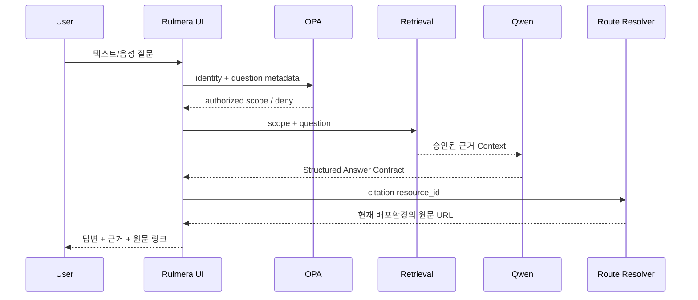

# 전체 아키텍처 v0.3

## 설계 핵심

Rulmera OPA Enterprise는 **지식운영 Core**와 **배포환경 Adapter**를 분리한다.

## 요청 처리 순서

## 기술선택 기준
- Frontend: React + TypeScript + Vite + PWA
- Android: Capacitor
- Backend: Python FastAPI
- Policy: Open Policy Agent (Rego)
- DB: PostgreSQL + pgvector
- Object: S3-compatible abstraction
- Model serving: 실제 A6000 벤치 후 선택
- Streaming: SSE 우선
- Container: Docker Compose PoC, 운영은 환경별 확장
- Edge/Web Adapter: Cloudflare Workers/Static Assets 또는 On-Prem Web Gateway
- `workerd`: Workers 호환이 필요할 때 **선택적** 사용

## 경계 원칙

### Core에 들어가는 것
- Identity/OPA 계약
- Knowledge Metadata
- Approval State
- Retrieval
- Citation
- Answer Contract
- Logical Route
- Audit

### Adapter로 분리하는 것
- Cloudflare Workers binding
- R2 endpoint/credentials
- On-Prem reverse proxy
- Customer Cloud ingress/load balancer
- 플랫폼별 secret/config

> [!warning]
> `workerd`는 Cloudflare Workers와 같은 계열 런타임이지만, Cloudflare 전체 플랫폼을 복제하는 것은 아니다. 자체 서비스 시 보안 경계는 VM/container/network 정책과 함께 구성한다.
