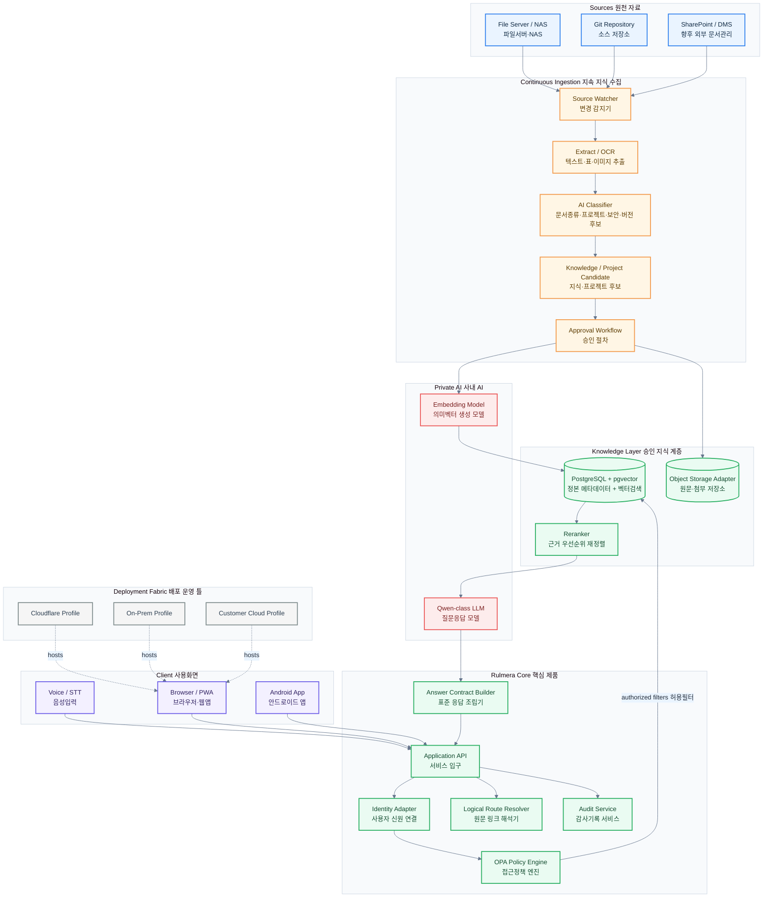
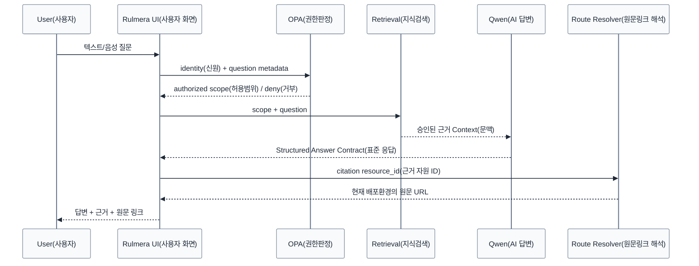
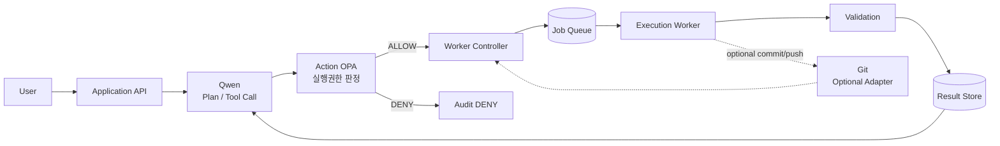

# 전체 아키텍처 v0.8 — Knowledge + Action OPA

> [!summary]
> 이 문서는 제품 구조, 데이터 흐름, 권한 구조, 동작 원리를 설명하는 설계 기준 문서다.

> [!info]
> 표기 기준: 전문 용어는 가능하면 `원어(알기 쉬운 설명)` 형식을 사용하고, 공통 기준은 [[20-설계/00-용어-스타일-가이드]]를 따른다.

## 설계 핵심
Rulmera OPA Enterprise는 **지식운영 Core(핵심 엔진)**, **Action Execution(실행 계층)**, **배포환경 Adapter(환경별 연결부)** 를 분리한다.

## 용어 짧게 보기
- **Source(원천 자료)**: 파일서버, NAS, Git 등 실제 문서가 생기는 곳
- **Ingestion(수집 파이프라인)**: 새 자료를 감지하고 추출·분류·승인 후보화하는 흐름
- **Knowledge Layer(지식 계층)**: 승인된 지식과 메타데이터를 저장하는 계층
- **Deployment Fabric(배포 운영 틀)**: Cloudflare, On-Prem, Customer Cloud 등 다른 운영환경을 같은 제품 구조로 감싸는 틀

## 요청 처리 순서

## 기술선택 기준
- Frontend: React + TypeScript + Vite + PWA
- Android: Capacitor
- Backend: Python FastAPI
- Policy: Open Policy Agent (Rego)
- DB: PostgreSQL + pgvector
- Object: S3-compatible abstraction
- Model serving: 실제 A6000 벤치 후 선택
- Streaming: SSE 우선
- Container: Docker Compose PoC, 운영은 환경별 확장
- Edge/Web Adapter: Cloudflare Workers/Static Assets 또는 On-Prem Web Gateway
- `workerd`: Workers 호환이 필요할 때 **선택적** 사용

## 경계 원칙
### Core에 들어가는 것
- Identity(사용자 신원)
- OPA Contract(정책 연동 규격)
- Knowledge Metadata(지식 메타데이터)
- Approval State(승인 상태)
- Retrieval(검색)
- Citation(근거 표시)
- Answer Contract(표준 응답)
- Logical Route(논리 원문 링크)
- Audit(감사 기록)

### Adapter로 분리하는 것
- Cloudflare Workers binding
- R2 endpoint / credentials
- On-Prem reverse proxy
- Customer Cloud ingress / load balancer
- 플랫폼별 secret / config

> [!warning]
> `workerd`는 Cloudflare Workers와 같은 계열 런타임이지만, Cloudflare 전체 플랫폼을 복제하는 것은 아니다. 자체 서비스 시 보안 경계는 VM / container / network 정책과 함께 구성한다.

## Action Execution(실행형 OPA) 추가
기존 질의/RAG 경로와 별도로 Qwen이 업무를 계획하고 Worker에 실행시키는 경로를 둔다.

### 두 Worker를 혼동하지 않는다
- `ingestion-worker`: 회사 원천자료를 감지·분류·색인하는 **지식 수집 Worker**
- `execution-worker`: 사용자의 승인된 작업을 파일/코드/문서/빌드/배포로 수행하는 **실행 Worker**

상세 설계: [[10-Qwen-Worker-실행아키텍처]], [[11-Worker-Job-Contract]]
