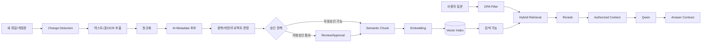

# RAG·지식 파이프라인 v0.3

## 핵심

> **새 사실은 Qwen을 반복 재학습시키지 않고, 승인된 지식을 증분 RAG로 갱신한다.**

고객의 사실지식을 모델 Weight에 계속 넣는 방식은 삭제·권한변경·버전관리·출처추적에 불리하다.  
Rulmera는 회사가 일하면서 생기는 파일을 지속 수집해 **최신 승인본을 검색가능한 상태로 유지**한다.

## 전체 파이프라인



## 증분 갱신

새 파일 300개가 들어왔다고 전체 10,000개를 재학습하지 않는다.

```text
신규/변경 문서 감지
→ 변경분만 추출
→ 변경분만 Chunk/Embedding
→ 기존 doc/version의 활성상태 변경
→ Index upsert/delete
→ 즉시 최신 지식으로 질의
```

## 분류 후보

자동분류는 **확정값이 아니라 후보**로 시작한다.

```yaml
tenant: A기업
project_candidate: 반도체장비-2027
document_type: PLC 프로그램 설명서
equipment: 세정기-03
department: 자동화팀
security_candidate: L3
knowledge_type: 기술문서
revision_candidate: Rev.4
approval_mode: HUMAN_REQUIRED
```

## 폴더보다 내용 우선 재검증

예: `일반자료/` 아래 파일이라도 다음이 검출되면 보안등급 상향 후보:
- NDA 문구
- 고객사명/프로젝트 코드
- 회로/PLC 소스
- 원가/단가
- 특허 전 기술
- 핵심 Recipe/알고리즘

## Chunk 전략
- 문서 제목/장/절 경계를 우선 유지
- 표는 Header와 함께 보존
- 소스코드는 함수/클래스 단위
- Chunk마다 `doc_id`, `version`, `locator`, `security_level`, `approval_status`, `project_id` 상속
- PoC에서는 500~1200 tokens 범위 실험

## Retrieval
1. OPA가 사용자별 authorized scope 생성
2. tenant/project/security/approval Metadata filter
3. Vector + Keyword Hybrid Search
4. 후보 20~40
5. Reranker top 5~10
6. 승인상태→버전→유효일 우선순위
7. 충돌자료가 있으면 경고 메타데이터 생성
8. Citation에 `resource_id + locator` 부여

## Fine-tuning은 언제 하는가

### 하지 않는 용도
- 최신 매뉴얼 기억
- 고객 프로젝트 사실 기억
- 원가/기밀 정보 저장
- 문서 개정판 반영

### 검토 가능한 용도
- 사내 보고서 문체
- 응답 구조 안정화
- 질문/업무분류
- 반복 Tool 호출 패턴

**권장 원칙: 사실은 RAG로, 습관은 Fine-tuning으로.**
