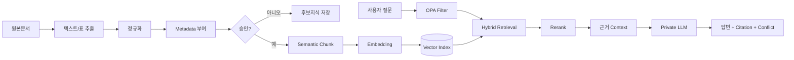

# RAG·지식 파이프라인

## 핵심: 처음에는 '학습'보다 '정리하고 찾아주는 것'부터
고객의 사실지식을 모델 weight에 다시 학습시키는 것이 1순위가 아니다. 먼저 문서를 잘 쪼개고, 권한·버전·승인정보를 붙이고, 질문 때 필요한 부분만 찾아 LLM에 넣는다.

## Chunk 전략 v0.1
- 문서 제목/장/절 경계를 우선 유지한다.
- 표는 행 단위로 무작정 분해하지 않고 Header와 함께 보존한다.
- 소스코드는 함수/클래스 단위.
- Chunk마다 `doc_id`, `page/slide/sheet`, `version`, `security_level`, `approval_status`를 상속한다.
- PoC에서는 500~1200 tokens 범위로 실험 후 평가셋 점수로 조정한다.

## Retrieval
1. OPA가 사용자별 필터를 생성
2. Metadata filter 적용
3. Vector + Keyword Hybrid Search
4. top_k 20~40 후보
5. Reranker로 top 5~10
6. 버전/승인/유효일 정렬
7. 충돌자료가 있으면 둘 다 숨기지 않고 경고 메타데이터 생성

## Fine-tuning은 언제 하는가
### 바로 하지 않는다
- 회사 사실은 문서 변경 시 즉시 바뀌어야 한다.
- Weight에 넣으면 삭제/권한변경/출처추적이 어렵다.

### 나중에 필요한 경우
- 회사 보고서 문체
- 답변 포맷
- 질문 분류
- 반복적인 도구호출 패턴

권장 시작조건: **검증된 Q&A/작업예시 500~2,000개 이상**이 누적되고, Prompt/RAG만으로 해결되지 않는 반복 패턴이 확인될 때 LoRA/QLoRA를 검토한다.
