# RAG·지식 파이프라인 v0.4 — 이해하기 쉬운 버전 v0.5

> [!summary]
> 이 문서는 제품 구조, 데이터 흐름, 권한 구조, 동작 원리를 설명하는 설계 기준 문서다.

> [!info]
> 표기 기준: 전문 용어는 가능하면 `원어(알기 쉬운 설명)` 형식을 사용하고, 공통 기준은 [[20-설계/00-용어-스타일-가이드]]를 따른다.

## 핵심
> **새 사실은 Qwen을 반복 재학습시키지 않고, 승인된 지식을 증분 RAG(검색증강생성)로 갱신한다.**

고객의 사실지식을 모델 Weight(모델 내부기억)에 계속 넣는 방식은 삭제·권한변경·버전관리·출처추적에 불리하다.  
Rulmera는 회사가 일하면서 생기는 파일을 지속 수집해 **최신 승인본을 검색 가능한 상태로 유지**한다.

## 주요 용어
- **Change Detection(변경 감지)**: 새 문서/개정본/삭제본을 찾는 단계
- **Chunk(지식 조각)**: 검색과 인용을 위해 문서를 일정 단위로 나눈 결과
- **Embedding(의미 벡터화)**: 문장 의미를 숫자 벡터로 바꾸는 작업
- **Hybrid Retrieval(혼합 검색)**: 키워드 검색 + 의미 검색을 함께 쓰는 방식
- **Rerank(재정렬)**: 찾은 후보 근거들을 더 적합한 순서로 다시 정렬하는 단계

## 전체 파이프라인

```mermaid
%%{init: {"theme":"base","themeVariables":{"primaryColor":"#F8FAFC","primaryTextColor":"#1F2937","primaryBorderColor":"#64748B","lineColor":"#64748B","secondaryColor":"#EAF4FF","tertiaryColor":"#EAFBF2","clusterBkg":"#F8FAFC","clusterBorder":"#CBD5E1","fontSize":"15px"}} }%%
flowchart LR
  SRC[New / Updated File<br/>새 파일·개정본] --> DET[Change Detection<br/>변경 감지]
  DET --> EXT[Extract Text / Table / OCR<br/>텍스트·표·이미지 추출]
  EXT --> NORM[Normalize<br/>형식 정리]
  NORM --> CLS[AI Metadata Suggestion<br/>메타데이터 후보 제안]
  CLS --> VERS[Version / Duplicate Check<br/>버전·중복 판정]
  VERS --> APP{Approval Policy<br/>승인 정책}
  APP -->|자동승인 가능| CHUNK[Semantic Chunk<br/>의미 단위 분할]
  APP -->|사람승인 필요| REVIEW[Review / Approval<br/>검토·승인]
  REVIEW --> CHUNK
  CHUNK --> EMB[Embedding<br/>의미벡터 생성]
  EMB --> IDX[(Vector Index<br/>벡터 색인)]
  IDX --> READY[Ready for Search<br/>검색 가능 상태]

  Q[User Question<br/>사용자 질문] --> POL[OPA Filter<br/>권한 필터]
  POL --> RET[Hybrid Retrieval<br/>혼합 검색]
  READY --> RET
  RET --> RR[Rerank<br/>우선순위 재정렬]
  RR --> CTX[Authorized Context<br/>허용된 근거 묶음]
  CTX --> LLM[Qwen]
  LLM --> RES[Answer Contract<br/>표준 응답]

  classDef a fill:#EAF4FF,stroke:#2F80ED,color:#102A43,stroke-width:2px;
  classDef b fill:#FFF6E5,stroke:#F2994A,color:#5C3B00,stroke-width:2px;
  classDef c fill:#EAFBF2,stroke:#27AE60,color:#114B2E,stroke-width:2px;
  classDef d fill:#FDECEC,stroke:#EB5757,color:#7A1F1F,stroke-width:2px;
  class SRC,Q a;
  class DET,EXT,NORM,CLS,VERS,APP,REVIEW b;
  class CHUNK,EMB,IDX,READY,POL,RET,RR,CTX,RES c;
  class LLM d;
```


## 증분 갱신이 왜 중요한가
새 파일 300개가 들어왔다고 전체 10,000개를 재학습하지 않는다.

```text
신규/변경 문서 감지
→ 변경분만 추출
→ 변경분만 Chunk/Embedding
→ 기존 doc/version의 활성상태 변경
→ Index upsert/delete
→ 즉시 최신 지식으로 질의
```

## 분류 후보 예시
자동분류는 **확정값이 아니라 후보**로 시작한다.

```yaml
tenant: A기업
project_candidate: 반도체장비-2027
document_type: PLC 프로그램 설명서
equipment: 세정기-03
department: 자동화팀
security_candidate: L3
knowledge_type: 기술문서
revision_candidate: Rev.4
approval_mode: HUMAN_REQUIRED
```

## 폴더보다 내용 우선 재검증
예: `일반자료/` 아래 파일이라도 다음이 검출되면 보안등급 상향 후보를 만든다.
- NDA 문구
- 고객사명 / 프로젝트 코드
- 회로 / PLC 소스
- 원가 / 단가
- 특허 전 기술
- 핵심 Recipe(제조 비법) / 알고리즘

## Chunk 전략
- 문서 제목 / 장 / 절 경계를 우선 유지
- 표는 Header(머리행)와 함께 보존
- 소스코드는 함수 / 클래스 단위
- Chunk마다 `doc_id`, `version`, `locator`, `security_level`, `approval_status`, `project_id` 상속
- PoC에서는 500~1200 tokens 범위 실험

## Retrieval(검색 회수) 순서
1. OPA가 사용자별 authorized scope(허용 범위) 생성
2. tenant/project/security/approval Metadata filter 적용
3. Vector + Keyword Hybrid Search 수행
4. 후보 20~40건 추림
5. Reranker로 top 5~10건 압축
6. 승인상태 → 버전 → 유효일 우선순위 반영
7. 충돌자료가 있으면 경고 메타데이터 생성
8. Citation에 `resource_id + locator` 부여

## Fine-tuning은 언제 하는가
### 하지 않는 용도
- 최신 매뉴얼 기억
- 고객 프로젝트 사실 기억
- 원가 / 기밀 정보 저장
- 문서 개정판 반영

### 검토 가능한 용도
- 사내 보고서 문체
- 응답 구조 안정화
- 질문 / 업무분류
- 반복 Tool 호출 패턴

**권장 원칙: 사실은 RAG로, 습관은 Fine-tuning으로.**
