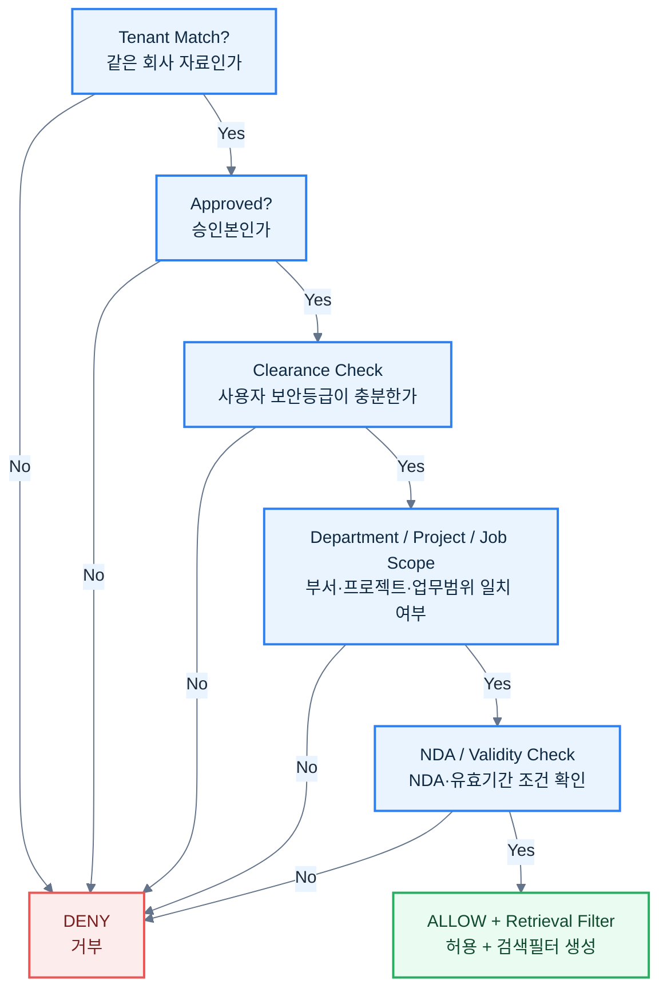

# OPA 권한모델 v0.4 — 쉬운 설명 포함 v0.5

> [!summary]
> 이 문서는 제품 구조, 데이터 흐름, 권한 구조, 동작 원리를 설명하는 설계 기준 문서다.

> [!info]
> 표기 기준: 전문 용어는 가능하면 `원어(알기 쉬운 설명)` 형식을 사용하고, 공통 기준은 [[20-설계/00-용어-스타일-가이드]]를 따른다.

## OPA(Open Policy Agent, 접근정책 엔진)란?
OPA는 **사용자가 어떤 지식을 조회·열람·다운로드·승인할 수 있는지**를 일관되게 판단하는 정책 엔진이다.  
핵심은 **AI가 알아서 보안을 판단하는 것이 아니라, 정책 엔진이 먼저 허용 범위를 결정**한다는 점이다.

## Query 권한 입력 예시
```json
{
  "user": {
    "tenant_id": "company-a",
    "department": "automation",
    "clearance": 3,
    "projects": ["line-2026"],
    "job_scopes": ["plc-maintenance"]
  },
  "request": {
    "action": "knowledge.query",
    "project_id": "line-2026",
    "channel": "voice"
  }
}
```

`channel`이 voice/text라고 해서 권한정책이 달라지지 않는다.

## Document(문서) 속성 예시
```json
{
  "tenant_id": "company-a",
  "security_level": 3,
  "department": "automation",
  "project_ids": ["line-2026"],
  "nda_customer": null,
  "approval_status": "APPROVED",
  "valid_to": null
}
```

## 기본 판정 흐름도


## Action(행동) 유형
- `knowledge.query` : 질문하기
- `knowledge.open` : 문서 열기
- `knowledge.download` : 파일 다운로드
- `knowledge.submit` : 새 지식 제출
- `knowledge.approve` : 승인하기
- `project.create` : 프로젝트 생성
- `policy.modify` : 정책 수정
- `audit.read` : 감사기록 보기

## Deep Link(원문 바로가기) 보안
답변에 Source Card(근거 카드)가 보였더라도, 사용자가 링크를 클릭하는 순간 다시 확인한다.
1. 현재 Identity(사용자 신원) 조회
2. `knowledge.open` OPA 판정
3. 허용 시 Route Resolver(원문링크 해석기) 수행
4. 거부 시 DENY + Audit(감사기록)

## Ingestion / Approval(수집 / 승인)
자동분류 서비스는 보안등급을 **결정**하지 않고 **후보를 제안**한다.  
고위험 유형은 `knowledge.approve` 권한을 가진 사용자의 승인 없이는 `APPROVED` 상태로 가지 않는다.

## 구현 원칙
- `default allow = false` (기본 거부)
- Policy와 조직/프로젝트 Data 분리
- Filter 없는 Retrieval API 금지
- Policy 변경 감사
- Query/Open/Download 각각 Action 분리
