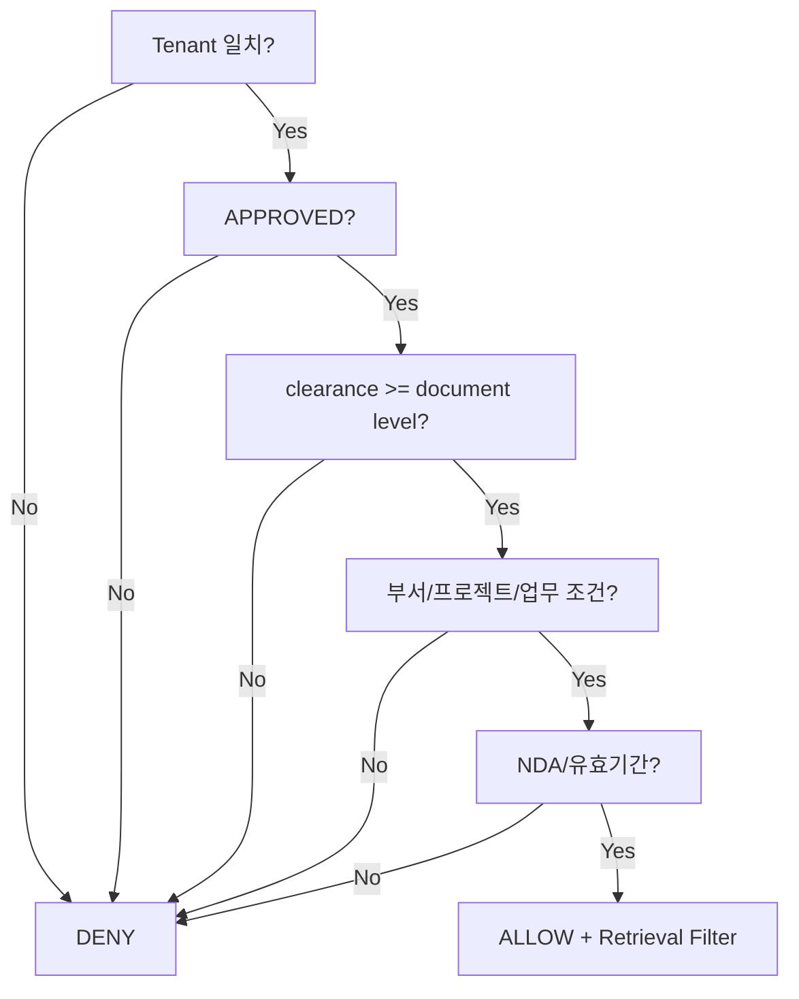

# OPA 권한모델 v0.3

## Query 권한 입력

```json
{
  "user": {
    "tenant_id": "company-a",
    "department": "automation",
    "clearance": 3,
    "projects": ["line-2026"],
    "job_scopes": ["plc-maintenance"]
  },
  "request": {
    "action": "knowledge.query",
    "project_id": "line-2026",
    "channel": "voice"
  }
}
```

`channel`이 voice/text라고 해서 권한정책이 달라지지 않는다.

## Document 속성

```json
{
  "tenant_id": "company-a",
  "security_level": 3,
  "department": "automation",
  "project_ids": ["line-2026"],
  "nda_customer": null,
  "approval_status": "APPROVED",
  "valid_to": null
}
```

## 기본 판정



## Action 유형
- `knowledge.query`
- `knowledge.open`
- `knowledge.download`
- `knowledge.submit`
- `knowledge.approve`
- `project.create`
- `policy.modify`
- `audit.read`

## Deep Link 보안
답변에 Source Card가 보였더라도 사용자가 링크를 클릭하는 시점에:
1. 현재 Identity 조회
2. `knowledge.open` OPA 판정
3. 허용 시 Route Resolver
4. 거부 시 DENY + Audit

을 수행할 수 있게 한다.

## Ingestion/Approval
자동분류 서비스는 보안등급을 **결정**하지 않고 후보를 제안한다.  
고위험 유형은 `knowledge.approve` 권한을 가진 사용자의 승인 없이는 `APPROVED` 상태로 가지 않는다.

## 구현 원칙
- `default allow = false`
- Policy와 조직/프로젝트 Data 분리
- Filter 없는 Retrieval API 금지
- Policy 변경 감사
- Query/Open/Download 각각 Action 분리
