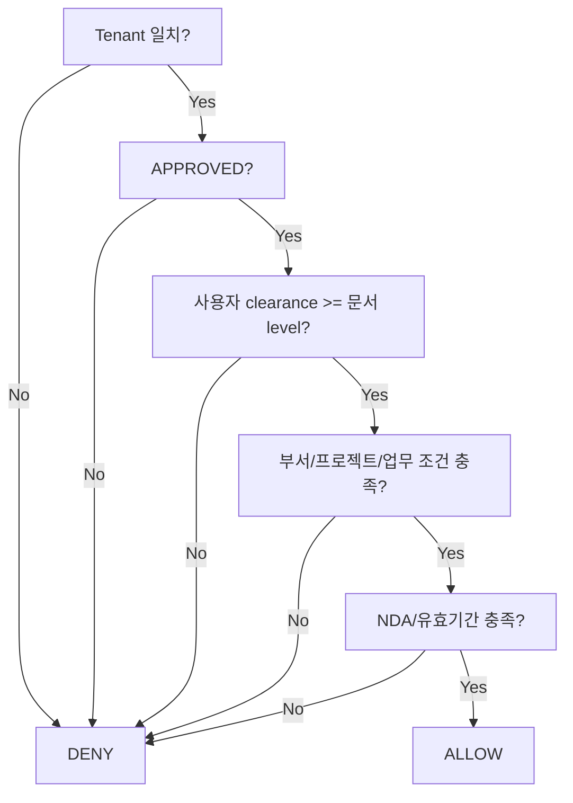

# OPA 권한모델 v0.1

## 권한 판정 입력 예시
```json
{
  "user": {
    "tenant_id": "company-a",
    "department": "automation",
    "clearance": 3,
    "projects": ["line-2026"],
    "job_scopes": ["plc-maintenance"]
  },
  "request": {
    "action": "knowledge.query",
    "project_id": "line-2026"
  }
}
```

## 문서 속성
```json
{
  "tenant_id": "company-a",
  "security_level": 3,
  "department": "automation",
  "project_ids": ["line-2026"],
  "nda_customer": null,
  "approval_status": "APPROVED",
  "valid_to": null
}
```

## 기본 판정


## 구현 원칙
- Policy와 조직/프로젝트 데이터는 분리한다.
- 고객별 정책을 복사해 하드코딩하지 않고 Template + data로 만든다.
- `default allow = false`.
- 검색 API는 OPA가 생성한 Filter 없이는 실행되지 않도록 한다.
- 관리자의 Policy 변경도 감사대상이다.
