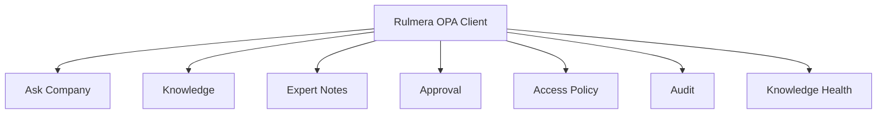

# 클라이언트 UI 설계 — 하나의 화면, 여러 기기

## 선택
**React + TypeScript + Responsive CSS + PWA + Capacitor Android**

이 조합의 목적은 기능을 두 번 만들지 않고, 윤석훈 팀장이 Windows 브라우저에서 매일 확인한 화면을 그대로 Android에서도 확인하는 것이다.

## 정보구조


## 화면 공통 구성
- 상단: Tenant / 현재 사용자 / 인가등급 / 연결상태
- 본문: Chat 또는 해당 기능
- 답변 카드: 본문 + 근거수 + 신뢰/주의 + 보안등급 표시
- 출처보기: 원문 제목/버전/페이지/슬라이드/시트
- 새 대화/History

## Desktop Wireframe 개념
```text
┌──────────────┬──────────────────────────────┬────────────────────┐
│ Sidebar      │ Chat / Main                  │ Evidence Panel      │
│ Ask          │ 질문                         │ [1] 문서 Rev.7 p.3  │
│ Knowledge    │ ──────────────────────────   │ [2] 장애 #032       │
│ Approval     │ 답변 + 근거 badge            │ 충돌/버전 정보       │
└──────────────┴──────────────────────────────┴────────────────────┘
```

## Mobile Wireframe 개념
```text
┌────────────────────────────┐
│ Tenant   RULMERA   L3  ☰   │
├────────────────────────────┤
│                            │
│        Chat / Main         │
│                            │
│ [근거 3건 보기]            │
├────────────────────────────┤
│ Ask  Know  +  Approval  Me │
└────────────────────────────┘
```

## 개발 원칙
- 기능 Component를 공유하고 Layout만 breakpoint로 전환한다.
- 데스크톱 우측 Evidence Panel은 모바일에서 Bottom Sheet가 된다.
- 데이터 테이블은 모바일 카드형으로 자동 전환 가능한 abstraction을 둔다.
- Android 고유기능은 파일선택/알림 등 꼭 필요한 것만 Capacitor Plugin으로 추가한다.
