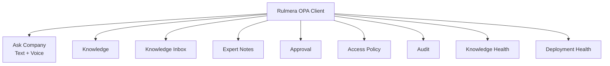

# 클라이언트 UI 설계 v0.3 — Rulmera가 화면을 소유한다

## 선택

**React + TypeScript + Responsive CSS + PWA + Capacitor Android**

## 핵심 원칙

> [!important]
> **Qwen 출력이 곧 화면이 되면 안 된다.**  
> Qwen은 HTML/레이아웃을 생성하지 않고, Rulmera가 정의한 `Answer Contract`를 반환한다.

이를 통해:
- 회사별 답변 화면이 흔들리지 않는다.
- Cloudflare/On-Prem에서도 동일한 UI를 유지한다.
- Citation/보안 Badge/충돌경고를 강제할 수 있다.
- 모델을 바꿔도 제품 UI는 그대로 유지된다.

## 정보구조



## 답변 구성
- 답변 본문
- 요약
- 다음 확인사항
- 보안/인가 표시
- 근거 개수
- 출처 목록
- 충돌/구버전/승인상태 경고
- 관련 문서
- 원문 Deep Link

## Source Panel

```text
[근거 1] M203 송풍기 제어 / Rev.4 / p.17
상태: 승인본 · L3 · 현재 유효
[원문 위치 열기]

[근거 2] 장애사례 #241
상태: 승인본 · L2
[사례 열기]
```

## Voice
- Web Speech/STT 또는 사내 STT Adapter를 교체 가능하게 설계
- STT Text를 사용자에게 보여주고 수정 허용
- 전송 이후 `/query` 처리 경로는 키보드 입력과 동일
- 음성 원문 저장 여부는 Tenant 정책으로 결정

## Deployment-neutral UI
Frontend는 환경별 절대 URL을 하드코딩하지 않는다.

```text
citation.resource_id
  ↓
GET /api/routes/resolve?resource_id=...
  ↓
현재 Profile에 맞는 URL
```

## 반응형
- Desktop: Sidebar + Main + Evidence Panel
- Tablet: 축약 Sidebar + Drawer
- Mobile: Top bar + Bottom Nav + Bottom Sheet
- Android: 동일 Build를 Capacitor로 패키징

## 개발 순서
1. Mock Answer Contract
2. Streaming Chat
3. Citation/Deep Link
4. Voice/STT
5. Identity/OPA Badge
6. Knowledge Inbox/Approval
7. Cloudflare/On-Prem UI Parity
8. Android package
