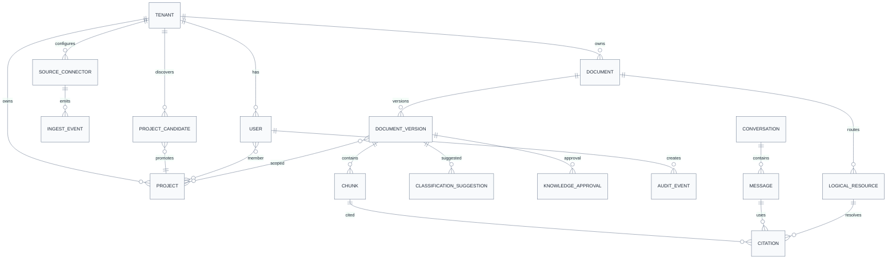
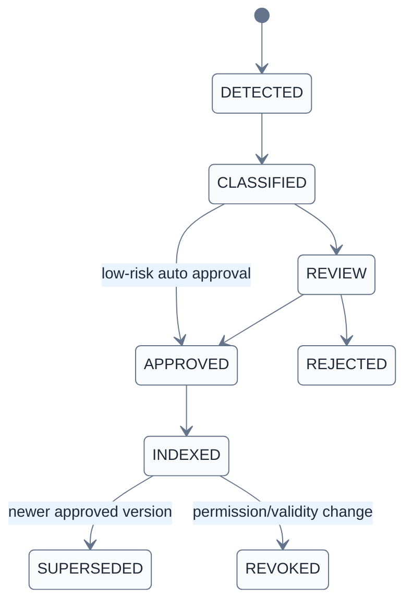

# 데이터모델 초안 v0.4 — 쉬운 해설 포함 v0.5

> [!summary]
> 이 문서는 제품 구조, 데이터 흐름, 권한 구조, 동작 원리를 설명하는 설계 기준 문서다.

> [!info]
> 표기 기준: 전문 용어는 가능하면 `원어(알기 쉬운 설명)` 형식을 사용하고, 공통 기준은 [[20-설계/00-용어-스타일-가이드]]를 따른다.

## 핵심 개념
- **Tenant(회사 단위)**: 고객 회사 구분
- **Document(문서)**: 실제 지식 원문
- **Document Version(문서 버전)**: 개정판 단위
- **Chunk(지식 조각)**: 검색 단위
- **Citation(근거 표시)**: 답변이 의존한 문서 위치
- **Logical Resource(논리 자원 링크)**: 배포환경과 무관한 원문 식별자

## 핵심 Table 해설
### tenant
- `id, name, status, policy_profile, deployment_profile`
- 한 고객사를 하나의 운영 단위로 나눈다.

### user
- `id, tenant_id, department, role, clearance_level, knowledge_level(K0~K4), status`
- 보안등급과 설명수준을 분리해서 표현한다.

### project
- `id, tenant_id, name, customer, security_default, status`
- 중랑, 광암, Radar처럼 실제 업무 단위 프로젝트.

### project_candidate
- `id, tenant_id, detected_name, source_path, confidence, suggested_security, status, approved_project_id`
- AI가 새 프로젝트로 의심한 후보를 담는다.

### project_membership
- `user_id, project_id, valid_from, valid_to`
- 사용자가 어떤 프로젝트를 언제까지 볼 수 있는지.

### source_connector
- `id, tenant_id, type(folder/nas/git/sharepoint...), config_ref, poll_mode, enabled`
- 지식 유입 경로.

### ingest_event
- `id, source_connector_id, source_uri, hash, event_type(create/update/delete), detected_at, status, error`
- 파일 유입·변경·삭제 감지 이력.

### document
- `id, tenant_id, title, source_type, owner, current_version_id`
- 문서 자체의 대표 레코드.

### document_version
- `id, document_id, version, security_level, department, approval_status, valid_from/to, source_uri, hash`
- 문서 개정판과 승인상태를 관리.

### classification_suggestion
- `id, document_version_id, field_name, suggested_value, confidence, reason, model_version, decision`
- AI가 왜 이런 분류를 추천했는지 남긴다.

### chunk
- `id, document_version_id, ordinal, text, embedding, locator(page/slide/sheet), token_count`
- 검색과 Citation의 실제 단위.

### knowledge_candidate
- `id, tenant_id, type(QA/incident/expert/decision), content, source, status`
- 전문가 노트, 장애사례, 의사결정 같은 추가 지식 후보.

### knowledge_approval
- `target_type, target_id, reviewer, approver, decision, timestamp, comment`
- 지식 승인 이력.

### logical_resource
- `id, tenant_id, resource_type, canonical_path, current_version_id`
- Citation이 배포 도메인에 종속되지 않도록 하는 논리 링크 단위.

### conversation / message
- 질의 History와 구조화된 답변 저장.

### citation
- `message_id, resource_id, document_version_id, locator, quote_hash, rank`
- 어떤 메시지가 어떤 근거를 사용했는지.

### audit_event
- `user_id, action, object_id, decision(ALLOW/DENY), policy_id, query_hash, timestamp`
- 누가 무엇을 시도했고 허용/거부됐는지.

### deployment_profile
- `profile_name(cloudflare/onprem/customer-cloud)`
- `public_base_url`
- `api_base_path`
- `object_adapter`
- `identity_adapter`
- `feature_flags`

## 상태 전이

