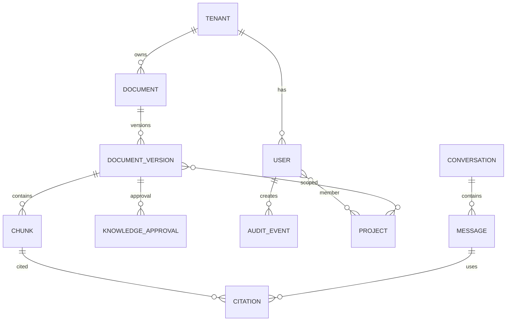

# 데이터모델 초안

## 핵심 Table
### tenant
- id, name, status, policy_profile

### user
- id, tenant_id, department, role, clearance_level, knowledge_level(K0~K4), status

### project_membership
- user_id, project_id, valid_from, valid_to

### document
- id, tenant_id, title, source_type, owner, current_version_id

### document_version
- id, document_id, version, security_level, department, approval_status, valid_from/to, source_uri, hash

### chunk
- id, document_version_id, ordinal, text, embedding, locator(page/slide/sheet), token_count

### knowledge_candidate
- id, tenant_id, type(QA/incident/expert/decision), content, source, status

### knowledge_approval
- candidate/document_version, reviewer, approver, decision, timestamp, comment

### audit_event
- user_id, action, object_id, decision(ALLOW/DENY), policy_id, query_hash, timestamp

### conversation/message/citation
- 대화 History와 답변 근거 추적
