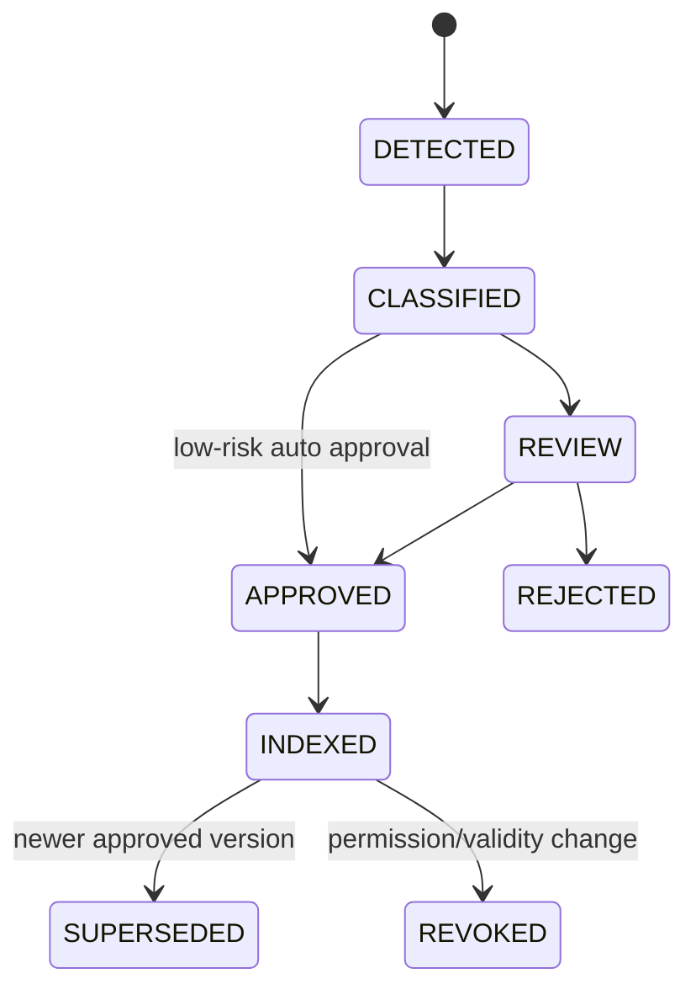

# 데이터모델 초안 v0.3

## 핵심 Table

### tenant
- id, name, status, policy_profile, deployment_profile

### user
- id, tenant_id, department, role, clearance_level, knowledge_level(K0~K4), status

### project
- id, tenant_id, name, customer, security_default, status

### project_candidate
- id, tenant_id, detected_name, source_path, confidence, suggested_security, status, approved_project_id

### project_membership
- user_id, project_id, valid_from, valid_to

### source_connector
- id, tenant_id, type(folder/nas/git/sharepoint...), config_ref, poll_mode, enabled

### ingest_event
- id, source_connector_id, source_uri, hash, event_type(create/update/delete), detected_at, status, error

### document
- id, tenant_id, title, source_type, owner, current_version_id

### document_version
- id, document_id, version, security_level, department, approval_status, valid_from/to, source_uri, hash

### classification_suggestion
- id, document_version_id, field_name, suggested_value, confidence, reason, model_version, decision

### chunk
- id, document_version_id, ordinal, text, embedding, locator(page/slide/sheet), token_count

### knowledge_candidate
- id, tenant_id, type(QA/incident/expert/decision), content, source, status

### knowledge_approval
- target_type, target_id, reviewer, approver, decision, timestamp, comment

### logical_resource
- id, tenant_id, resource_type, canonical_path, current_version_id
- Citation이 배포 도메인에 종속되지 않도록 하는 논리 링크 단위

### conversation / message
- 질의 History와 구조화된 답변 저장

### citation
- message_id, resource_id, document_version_id, locator, quote_hash, rank

### audit_event
- user_id, action, object_id, decision(ALLOW/DENY), policy_id, query_hash, timestamp

### deployment_profile
- profile_name(cloudflare/onprem/customer-cloud)
- public_base_url
- api_base_path
- object_adapter
- identity_adapter
- feature_flags

## 상태 전이

