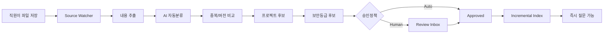
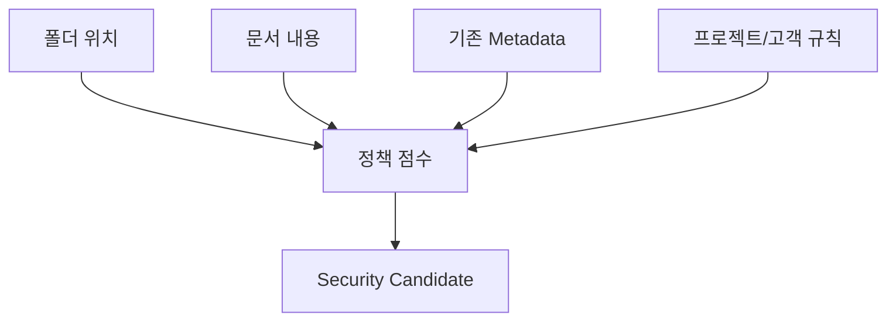

# 지속 지식흡수 운영설계 — Continuous Knowledge

> [!summary]
> 고객사가 새 프로젝트를 할 때마다 룰메라 개발자가 방문해 다시 “학습”시키는 구조가 아니다.  
> **회사가 평소처럼 자료를 저장하면 Rulmera가 변경분을 자동으로 지식 후보화하고, 정책에 따라 승인 후 즉시 RAG에 반영**하는 구조가 목표다.

## 1. 왜 필요한가

초기 구축 때 지식이 좋아도 회사는 다음 달에:
- 신규 프로젝트를 시작하고
- 매뉴얼이 개정되고
- 장애가 발생하고
- 설계변경을 하고
- 숙련자 판단이 추가된다.

따라서 제품의 수명은 “초기 데이터셋 품질”이 아니라 **지속해서 최신 정본을 만드는 능력**으로 결정된다.

## 2. 기본 운영흐름



## 3. 권장 Source 구조 예

```text
\\RULMERA-KNOWLEDGE
 ├─ 00-INBOX
 │   ├─ 프로젝트A
 │   ├─ 프로젝트B
 │   └─ 기술자료
 ├─ 10-REVIEW
 ├─ 20-APPROVED
 └─ 90-ARCHIVE
```

단, 이 폴더는 **운영 편의**일 뿐 권한의 진실(Source of Truth)이 아니다.

## 4. 자동분류 항목

- Tenant
- Project / Customer
- Department
- Document Type
- Equipment / Product
- Security Candidate L0~L5
- Knowledge Type
- Version/Revision
- Effective Date
- Duplicate/near-duplicate
- Existing document family
- Approval Mode

## 5. 신규 프로젝트 자동감지

예:

```text
2027_삼성_검사장비/
```

기존 Project Master에 없으면:

```text
신규 프로젝트 후보
- 추정명: 삼성 검사장비
- 고객: 삼성
- 추정부서: 자동화팀
- 기본 보안후보: L3
- 최초 자료: 17건

[프로젝트 생성]
[기존 프로젝트에 연결]
[보류]
```

승인 후 `project_id`를 발급하고 이후 파일은 같은 문맥에 자동 연결한다.

## 6. 자동승인과 사람승인

### 자동승인 가능 후보
- 공개 카탈로그
- 이미 승인된 템플릿과 동일 규칙의 저위험 문서
- 사내 공지/일반 절차 등 정책에서 허용한 유형

### 사람승인 필수
- PLC/소스
- 회로/설계도
- 고객 NDA
- 원가/견적
- 핵심 Recipe/알고리즘
- 특허 전 기술
- 신규 프로젝트 최초 문서
- 보안분류 확신도가 낮은 문서

## 7. “폴더 신뢰” 금지



폴더는 힌트이며, **문서 내용이 더 높은 위험을 보이면 상향 후보**를 생성한다.

## 8. 증분 색인

- SHA-256 등 Content Hash로 변경 감지
- 신규/변경/삭제 이벤트 분리
- 변경 버전만 재-Chunk/Embedding
- 이전 승인본은 `SUPERSEDED`
- 삭제/권한회수는 Vector Index에서도 제거/비활성
- Index Job은 재시도/Dead Letter Queue를 고려

## 9. 운영자가 보는 Inbox

| 상태 | 예시 |
|---|---|
| 새 문서 | 42건 |
| 신규 Project Candidate | 2건 |
| 보안등급 상향 제안 | 4건 |
| 버전 충돌 | 3건 |
| 분류 확신도 낮음 | 7건 |
| Index 실패 | 1건 |

## 10. 사람의 역할 변화

초기 구축 이후 룰메라 운영자의 역할은 “문서를 대신 정리하는 사람”이 아니라:
- 분류체계/정책 개선
- 자동분류 정확도 개선
- 승인 Workflow 최적화
- 평가셋/보안시험 유지
- Connector/배포 업데이트

고객사 담당자는:
- Project Candidate 승인
- 중요 지식 사실확인
- 보안등급/정본 최종 승인

## 11. 성공조건

- 고객사 신규 자료가 룰메라 개발자 방문 없이 유입 가능
- 변경분만 증분 반영
- 신규 프로젝트 후보 자동탐지
- 승인 전 고위험 자료는 RAG 미노출
- 최신 승인본이 기존 버전을 대체
- 모든 자동판단과 사람승인이 감사 가능
