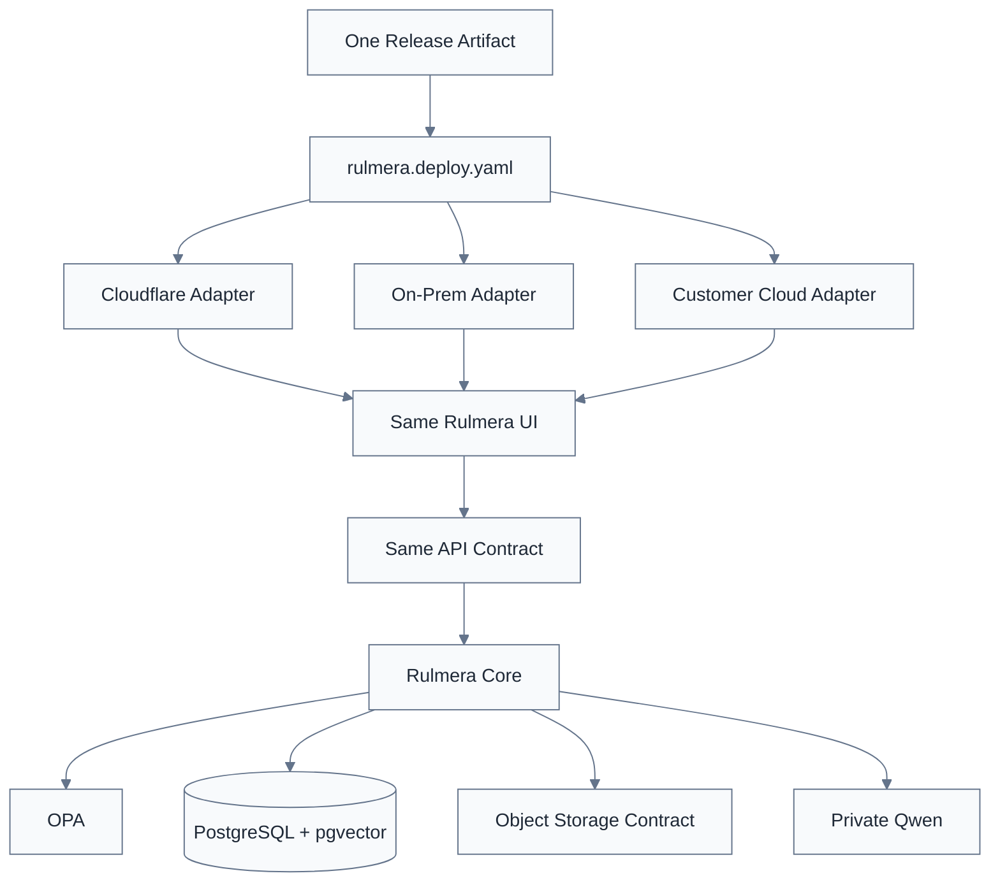

# Rulmera Deployment Fabric — Build Once, Deploy Anywhere v0.5

> [!summary]
> 이 문서는 제품 구조, 데이터 흐름, 권한 구조, 동작 원리를 설명하는 설계 기준 문서다.

> [!info]
> 표기 기준: 전문 용어는 가능하면 `원어(알기 쉬운 설명)` 형식을 사용하고, 공통 기준은 [[20-설계/00-용어-스타일-가이드]]를 따른다.

## 1. 목적

Rulmera를 Cloudflare용 제품과 On-Prem용 제품으로 따로 만들지 않는다.

> **하나의 Rulmera Release가 배포 Profile만 바꿔 Cloudflare, 고객사 내부망, 고객 자체 Cloud에서 동일하게 동작해야 한다.**

## 2. 기술적으로 가능한 범위

### 가능한 것
- 같은 React/Vite Client Build
- 같은 API Contract
- 같은 `/api/*`, `/knowledge/*` 논리 Routing
- 같은 OPA Policy
- 같은 RAG/Approval/Audit Core
- Object Storage Adapter 교체
- Identity Adapter 교체
- Cloudflare Workers 계열 코드를 `workerd` 기반으로 자체호스팅하는 선택지

### 완전히 같지 않은 것
- Cloudflare 글로벌 Edge 위치
- 관리형 CDN 캐시 규모
- Anycast/DDoS 보호
- Cloudflare Dashboard/관리 서비스
- Cloudflare 전용 관리형 Storage의 내부 구현

즉 **기능동등성(Product Parity)**을 목표로 하지, **플랫폼 복제(Infrastructure Cloning)**를 목표로 하지 않는다.

## 3. 구조



## 4. 배포 Profile

### cloudflare
- Workers + Static Assets
- Custom Domain
- Worker API/Edge gateway
- R2는 Object Adapter 후보
- Private AI/DB는 고객 요구에 따라 별도 Private Origin과 연결 가능

### onprem
- Nginx/Caddy/Traefik 또는 표준 Web Gateway
- Docker Compose 우선
- PostgreSQL+pgvector
- MinIO 또는 S3-compatible storage
- Private Qwen GPU server
- 외부망 완전 차단 가능

### customer-cloud
- 고객 VM/Container/Kubernetes
- 고객 Load Balancer/Ingress
- 고객 Object Storage/S3
- 고객 Identity(OIDC/LDAP)
- Qwen은 같은 사설망 또는 전용 AI 서버

## 5. `workerd`의 위치

`workerd`는 Cloudflare Workers를 구동하는 것과 같은 계열의 오픈소스 JavaScript/Wasm 런타임이다. 자체 서버에서 Workers용 앱을 호스팅할 수 있다.

하지만:
- Cloudflare 전체 플랫폼이 아니다.
- 보안 격리를 이것 하나에 의존하지 않는다.
- Rulmera On-Prem의 필수 구성요소로 고정하지 않는다.

따라서 **Workers 호환 Gateway가 이득일 때 선택하는 Adapter**로 둔다.

## 6. Database 원칙

Cloudflare D1은 SQLite semantics 기반이므로 Rulmera Core DB의 표준으로 삼지 않는다.

**표준: PostgreSQL + pgvector**

이유:
- Vector/RAG Metadata
- 관계형 승인 Workflow
- On-Prem 운영
- 고객 Cloud 이식성
- DB Fork 최소화

D1을 쓰더라도 Edge 보조 데이터 등 제한된 역할로만 검토한다.

## 7. Object Storage 원칙

R2는 S3 API 호환을 제공하지만 AWS S3의 모든 기능이 동일한 것은 아니다.  
따라서 Rulmera는 **실제로 필요한 최소 S3 API Subset**만 Object Contract로 정의한다.

예:
- PUT object
- GET object
- HEAD object
- DELETE object
- List prefix
- Presigned URL 또는 대체 Download Token

## 8. Logical Route

절대 URL을 지식에 저장하지 않는다.

```text
resource_id = doc:a-company:plc-manual:rev4
locator = page:37

Cloudflare:
https://knowledge.a.com/knowledge/doc/...?... 

On-Prem:
https://rulmera.local/knowledge/doc/...?...
```

Qwen은 두 URL을 알 필요가 없다.

## 9. 선언형 Manifest 예

```yaml
profile: onprem
version: v0.3

routes:
  api_prefix: /api
  knowledge_prefix: /knowledge

database:
  driver: postgres

object_storage:
  adapter: s3
  endpoint_ref: env:RULMERA_S3_ENDPOINT

identity:
  adapter: oidc

ai:
  provider: private-qwen
  endpoint_ref: env:RULMERA_LLM_URL
```

## 10. Air-Gap

Full On-Prem에서는:
- 설치 패키지 사전 반입
- Container image bundle
- Model file bundle
- Python/Node 의존성 고정
- License/모델 출처 기록
- Offline upgrade bundle
- Rollback snapshot

을 준비한다.

## 11. Parity Gate

Cloudflare와 On-Prem에서 다음 동일 시험을 통과해야 한다.

- 로그인
- Text query
- Voice→Text→Query
- OPA Allow/Deny
- RAG Citation
- Deep Link
- Knowledge Inbox
- Approval
- Audit
- 파일 업로드/수집
- Backup/restore(해당 환경)
