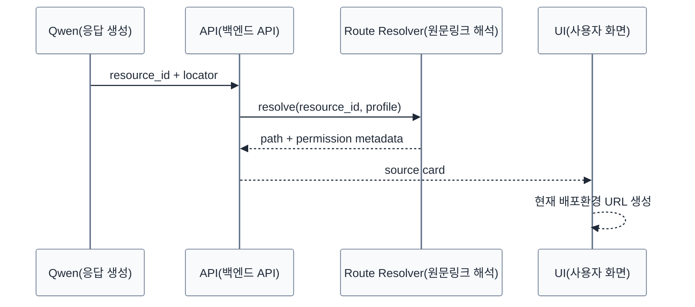

# Qwen 응답계약·근거링크 설계 v0.5

> [!summary]
> 이 문서는 제품 구조, 데이터 흐름, 권한 구조, 동작 원리를 설명하는 설계 기준 문서다.

> [!info]
> 표기 기준: 전문 용어는 가능하면 `원어(알기 쉬운 설명)` 형식을 사용하고, 공통 기준은 [[20-설계/00-용어-스타일-가이드]]를 따른다.

## 목적
Qwen이 매 질문마다 다른 HTML / Markdown UI를 만들어 버리면 제품 템플릿이 흔들리고 근거표시를 강제하기 어렵다.

따라서 Qwen의 출력은 **Rulmera Answer Contract(표준 응답 규격)** 으로 제한한다.

## 기본 Contract
```json
{
  "answer": "자연어 답변",
  "summary": "핵심 요약",
  "next_actions": [
    "첫 번째 확인사항"
  ],
  "sources": [
    {
      "resource_id": "doc:a:plc-manual:rev4",
      "locator": "page:37",
      "title": "PLC 유지보수 매뉴얼",
      "version": "Rev.4",
      "support": "이 근거가 뒷받침하는 요점"
    }
  ],
  "related_resources": [],
  "warnings": [],
  "confidence": "high",
  "security_context": {
    "clearance": "L3"
  }
}
```

> 실제 JSON Schema는 개발단계에서 버전관리한다.

## 금지
- Qwen이 `<div>`, CSS, 전체 HTML 페이지를 생성
- Qwen이 직접 Cloudflare / On-Prem 도메인을 조합
- Qwen이 권한 Badge를 임의 결정
- Qwen이 출처가 없는 링크를 생성
- Qwen이 승인상태를 추정

## Rulmera가 후처리하는 값
- 실제 원문 URL
- 사용자에게 보여줄 보안 Badge
- 승인상태
- 문서버전
- Tenant 표시
- Source click permission
- Conflict / obsolete 표시

## Citation(근거표시) → Deep Link(원문 바로가기)


## 음성질의
음성은 Input Adapter(입력 수단)일 뿐 답변 경로는 같다.

```mermaid
%%{init: {"theme":"base","themeVariables":{"primaryColor":"#F8FAFC","primaryTextColor":"#1F2937","primaryBorderColor":"#64748B","lineColor":"#64748B","secondaryColor":"#EAF4FF","tertiaryColor":"#EAFBF2","clusterBkg":"#F8FAFC","clusterBorder":"#CBD5E1","fontSize":"15px"}} }%%
flowchart LR
  MIC[Microphone<br/>마이크] --> STT[STT<br/>음성을 문자로 변환]
  STT --> TXT[Canonical Text Question<br/>표준 질의문]
  TXT --> OPA[OPA<br/>권한판정]
  OPA --> RAG[RAG<br/>허용근거 검색]
  RAG --> QW[Qwen<br/>답변 생성]
  QW --> JSON[Answer Contract<br/>표준 응답 데이터]
  JSON --> UI[Rulmera Template<br/>회사 화면 규칙]
```



## 모델 교체성
Qwen을 다른 모델로 바꾸더라도:
- 동일 Answer Contract
- 동일 OPA
- 동일 Citation schema
- 동일 Rulmera UI

를 유지하면 제품은 흔들리지 않는다.
