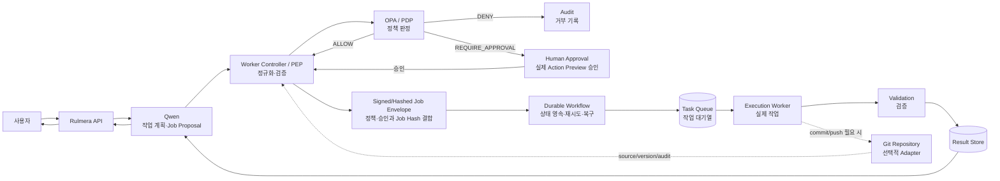
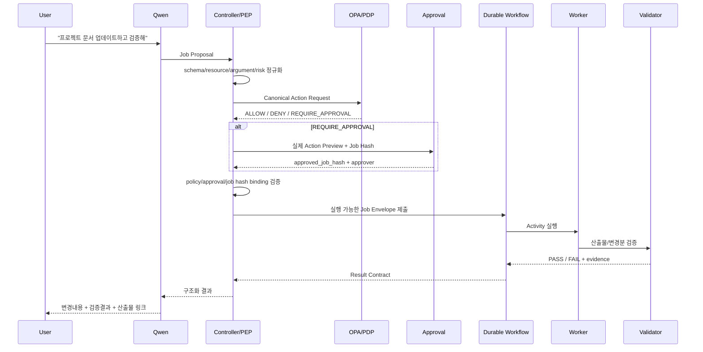

# Qwen Worker 실행 아키텍처 v0.9

> [!summary]
> Rulmera OPA를 **답변형 Knowledge OPA**에서 **안전한 실행형 Action OPA**까지 확장한다. Qwen은 작업을 제안하고, Worker Controller가 실행 요청을 정규화·검증하며, OPA가 정책을 판정하고, Durable Workflow가 실행 상태를 보존하며, Worker가 실제 작업을 수행한다.

## 1. 한 문장 정의
**Qwen은 제안하고, Controller가 사실관계를 확정하고, OPA가 허가하고, Workflow가 실행을 보장하고, Worker가 수행한다.**

## 2. 핵심 용어 정의
이 문서에서 처음 사용하는 주요 용어는 다음과 같이 정의한다.

| 용어 | 쉬운 정의 | Rulmera에서의 역할 |
|---|---|---|
| PEP(Policy Enforcement Point, 정책 집행 지점) | 정책 판정 결과를 실제 실행에 적용하는 곳 | Worker Controller가 담당. Job을 정규화하고 OPA 결과 없이 실행되지 않게 막는다. |
| PDP(Policy Decision Point, 정책 판단 지점) | 구조화된 요청을 보고 허용·거부·승인필요를 결정하는 곳 | OPA가 담당한다. |
| Canonical Job(정규 작업 요청) | Qwen의 자연어/초안을 실행 가능한 표준 필드로 확정한 Job | Controller가 생성한다. |
| Job Hash(작업 해시) | Job 내용이 바뀌지 않았음을 확인하는 SHA-256 등 고정 지문 | 승인·정책판정과 실제 실행 Job을 묶는다. |
| Durable Workflow(내구성 작업흐름) | 서버·Worker 장애가 나도 작업 진행상태를 잃지 않고 이어서 처리하는 실행 방식 | 장시간 작업, 재시도, 승인 대기, 복구를 관리한다. |
| Activity(개별 실행 작업) | Workflow 안에서 실제 수행되는 한 단계 작업 | 예: 문서변환, 테스트, 빌드, 배포. |
| Retry(재시도) | 일시적 실패가 났을 때 정해진 규칙으로 다시 실행하는 것 | 무한 반복이 아니라 정책 횟수·조건으로 제한한다. |
| Timeout(제한시간) | 작업이 비정상적으로 오래 걸릴 때 중단·실패로 판정하는 시간 제한 | Activity/Job 단위로 둔다. |
| Task Queue(작업 대기열) | 실행해야 할 일을 Worker가 가져갈 수 있게 쌓아두는 대기열 | Worker 유형별 작업 분배에 사용한다. |
| Approval Binding(승인 결합) | 사람이 승인한 정확한 Job 내용과 실제 실행 Job이 동일함을 보장하는 방식 | `approved_job_hash`로 강제한다. |

## 3. 최종 기준 아키텍처
Git이 없어도 Worker 구조는 성립한다. Git은 선택적 Source/Job/Audit Adapter다.



## 4. 왜 Qwen이 OPA를 직접 호출하지 않는가
v0.8의 `Qwen → OPA → Controller` 표현은 논리 설명에는 단순했지만 실제 보안 집행 구조로는 부족하다.

Qwen이 스스로 `risk=LOW`, `action=workspace.write`라고 선언했다고 해서 그 값을 신뢰하면 안 된다. 실제 실행대상, 파일경로, 삭제여부, 네트워크 접근, 환경, 변경량을 **Controller가 정규화**한 뒤 OPA에 보내야 한다.

```text
Qwen Job Proposal
    ↓
Worker Controller / PEP
    - schema 검증
    - 실제 resource/path 확정
    - tool argument 정규화
    - environment 확정
    - side effect 계산
    - risk 입력 생성
    ↓
OPA / PDP
    ↓
DENY | REQUIRE_APPROVAL | ALLOW
```

## 5. Knowledge OPA와 Action OPA의 분리
### Knowledge OPA
“이 사용자가 이 지식을 볼 수 있는가?”를 판단한다.

`사용자 → Identity → OPA → 허용 Retrieval → Qwen → 근거답변`

### Action OPA
“이 사용자가 AI에게 이 작업을 실행시킬 수 있는가?”를 판단한다.

`사용자 → Qwen 제안 → Controller/PEP → OPA/PDP → Workflow → Worker → Result`

두 경로는 같은 Identity/Tenant/Project 정보를 사용하지만 **행동·자원·인자·환경·위험도는 별도로 판정**한다.

## 6. 구성요소 역할
| 구성요소 | 역할 | 금지사항 |
|---|---|---|
| Qwen | 의도 이해, 계획, Job Proposal, Tool Call 제안, 결과 설명 | Secret 보유, 직접 shell 실행, 최종 권한판정 |
| Worker Controller / PEP | Job 정규화, 실제 Resource/Argument 확정, OPA 호출, 승인/해시 검증, 라우팅 | Qwen이 주장한 위험등급을 그대로 신뢰, OPA 우회 |
| OPA / PDP | 사용자·Tenant·Project·Tool·Resource·Argument·환경·위험 기준 ALLOW/DENY/REQUIRE_APPROVAL | LLM 추론을 근거로 자동 허용 |
| Human Approval Gate | 고위험 작업의 실제 Action Preview 승인 | Qwen 자연어요약만 보고 승인 |
| Durable Workflow | Job 상태 영속, 재시도, Timeout, 승인대기, 장애복구 | 비영속 메모리만으로 장시간 Job 관리 |
| Task Queue | Worker에게 실행단위 전달, 동시성/부하분산 | 민감 원문을 무조건 전체 포함 |
| Execution Worker | 파일/코드/문서/테스트/빌드/배포 실제 수행 | 허용 범위 밖 Tool/Path/Network 실행 |
| Result Store | 로그, 변경파일, 산출물, 검증결과, 해시 저장 | 감사기록 임의 덮어쓰기 |
| Git Adapter | 선택적 소스/형상관리/작업지시/감사 | 회사 지식이나 Job 전달의 필수 경로 강제 |

## 7. 실행 흐름


## 8. Tool 이름만이 아니라 인자와 자원까지 판정한다
잘못된 예:

```text
workspace.write = ALLOW
```

기준 예:

```yaml
action: workspace.write
resource: /tenant-a/radar/**
operation: update
allow_delete: false
network: deny
environment: dev
max_files: 100
```

같은 `workspace.write`라도 다른 Tenant 경로, 대량 삭제, Production, 외부 네트워크 전송이면 별도 정책이 적용된다.

## 9. 승인 바인딩
고위험 Job의 승인은 자연어 설명이 아니라 **Controller가 만든 실제 실행 미리보기(Action Preview)**를 기준으로 한다.

```text
PROJECT     : radar
ACTION      : repository.write
FILES       : 17
DELETE      : 0
NETWORK     : DENY
ENVIRONMENT : production
JOB HASH    : sha256:8c37...
```

승인 후 Job 내용이 바뀌면 해시가 달라지므로 실행을 거부한다.

필수 필드:
- `job_hash`
- `policy_version`
- `policy_decision_id`
- `approved_job_hash`
- `approved_by`
- `approved_at`
- `approval_expires_at`

## 10. Durable Workflow 적용 원칙
PoC에서 처음부터 특정 제품에 종속시키지 않는다. Core Contract에는 **Durable Workflow Adapter**를 둔다.

초기 경량형:
`FastAPI + PostgreSQL + Queue Adapter`

장시간·고신뢰 운영형 후보:
`FastAPI + Temporal 같은 Durable Workflow Engine`

Temporal은 **작업 진행상태를 영속적으로 저장하고, 서버나 Worker가 중단돼도 이어서 실행하도록 돕는 Workflow 엔진 계열**의 대표 후보로 취급한다. 제품 Core는 Temporal API에 직접 종속되지 않는다.

## 11. Worker Controller의 책임
- Job Proposal → Canonical Job 정규화
- Tool/Resource/Argument/Environment 확정
- OPA decision 요청·검증
- Job Hash 생성 및 정책/승인 결합
- `tenant_id`, `project_id`, `workspace_id` 격리
- Workflow 상태 전이 관리
- Job 유형별 Worker 라우팅
- 동시 실행 제한
- Timeout / Retry / Dead Letter 처리
- Human Approval Gate
- Idempotency(중복 실행 방지)
- Tool Allowlist
- 산출물 Hash / 변경목록 수집
- 결과 감사로그 연결

## 12. Worker 격리 모델
```text
Tenant A
  └─ Project P1
      └─ Job J101
          └─ Ephemeral Workspace(작업 종료 후 폐기 가능한 격리 작업공간)
              ├─ input/
              ├─ work/
              ├─ output/
              └─ logs/
```

원칙:
- 다른 Tenant/Project Workspace를 mount하지 않는다.
- Worker에는 필요한 최소 권한만 제공한다.
- Secret은 Secret Store에서 실행 시점에 주입하고 Qwen Context에 넣지 않는다.
- 네트워크는 Job 유형별 Allowlist를 둔다.
- 파괴적 명령은 별도 승인 정책을 둔다.

## 13. Git 사용 패턴
### A. Git 없는 기본형
`Qwen → Controller → OPA → Workflow → Worker → Result Store`

### B. Git을 형상관리로 사용
Worker가 작업 후 commit/branch/PR을 생성한다.

### C. Git을 Job Adapter로도 사용
기존 GPT Worker처럼 `worker/tasks/*.json`을 감지하는 방식도 지원한다. 다만 Git은 Adapter이며 Core Job Contract는 동일하다.

## 14. 실행 감사
한 Job에 다음을 연결한다.
- 누가 요청했는가
- Qwen이 어떤 Proposal을 만들었는가
- Controller가 어떤 Canonical Job으로 확정했는가
- OPA가 어떤 정책 버전으로 판단했는가
- 승인 당시 Job Hash는 무엇이었는가
- 어떤 Workflow/Worker/Tool이 실행됐는가
- 어떤 파일과 시스템이 바뀌었는가
- 어떤 시험이 통과/실패했는가
- 결과 산출물 Hash가 무엇인가

## 15. 설계 경계
> [!important]
> Qwen의 Tool Calling 능력과 Worker 실행권한을 같은 것으로 보지 않는다. **LLM은 실행을 제안할 뿐이고, Controller가 실제 요청을 확정하며, OPA가 정책을 판정하고, Workflow/Worker가 제한된 실행을 한다.**

## 16. 관련 문서
- [[11-Worker-Job-Contract]]
- [[12-Durable-Workflow-설계]]
- [[13-Action-Authorization-Enforcement]]
- [[03-OPA-권한모델]]
- [[../10-요구사항/06-Agentic-Worker-요구사항]]
