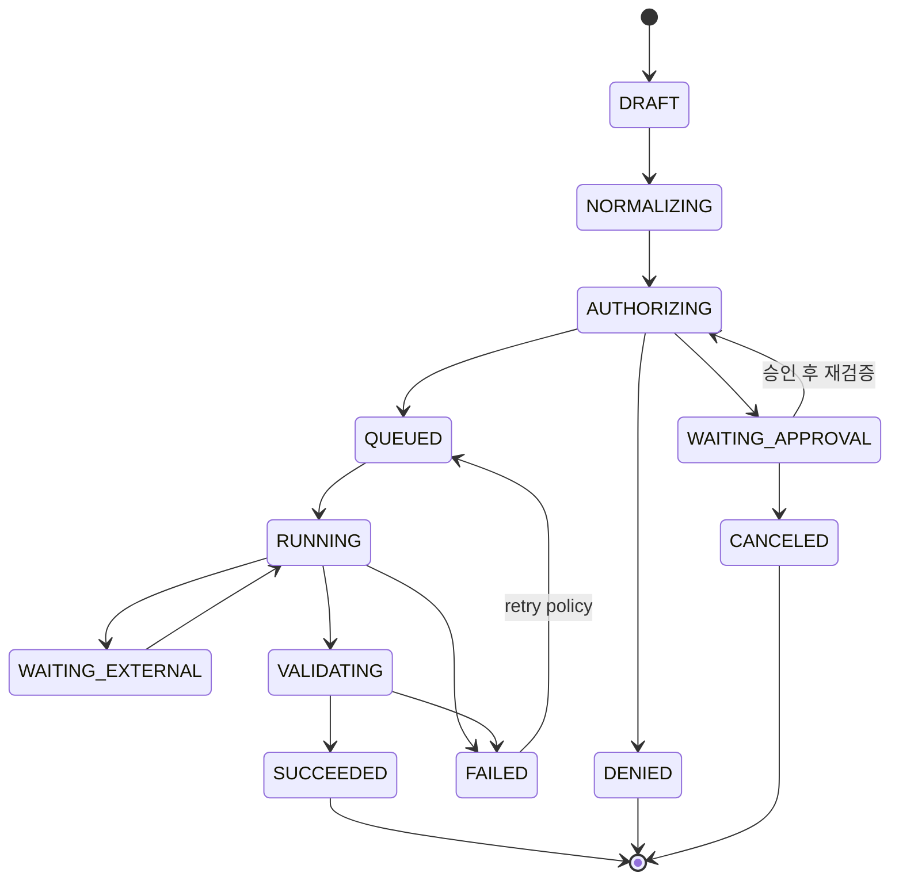

# Worker Job Contract v0.9

> [!summary]
> Qwen과 Worker 사이를 자연어가 아니라 검증 가능한 구조화 데이터로 연결하고, 정책판정과 사람승인을 **Job Hash(작업 내용 고정 지문)**에 결합하는 정식 Job/Result 계약이다.

## 1. 용어 정의
- **Job Proposal(작업 제안)**: Qwen이 사용자 의도를 바탕으로 만든 실행 초안. 그대로 실행하지 않는다.
- **Canonical Job(정규 작업 요청)**: Worker Controller가 실제 경로·인자·환경·자원을 확인해 표준형으로 확정한 Job.
- **Job Hash(작업 해시)**: Canonical Job 본문의 변경 여부를 검증하는 SHA-256 등 고정 지문.
- **Approval Binding(승인 결합)**: 사람이 승인한 Job Hash와 실행 직전 Job Hash가 같을 때만 실행하도록 묶는 방식.
- **Idempotency Key(중복실행 방지키)**: 같은 요청이 재전송돼도 동일 작업이 두 번 실행되지 않게 식별하는 키.
- **Job Envelope(작업 봉투)**: Canonical Job, 정책결정, 승인정보, 해시를 함께 묶어 Workflow에 넘기는 구조.

## 2. Job Contract 예시
```json
{
  "schema_version": "rulmera.job.v2",
  "job_id": "job-20260917-0001",
  "idempotency_key": "tenant-a:project-radar:req-1234",
  "tenant_id": "tenant-a",
  "project_id": "radar",
  "requested_by": "user-id",
  "job_type": "project.update",
  "environment": "project-workspace",
  "requested_tools": [
    "workspace.read",
    "workspace.write",
    "test.run"
  ],
  "resources": [
    "/tenant-a/radar/**"
  ],
  "constraints": {
    "network": "deny",
    "max_runtime_sec": 1800,
    "max_files": 100,
    "allow_delete": false
  },
  "tasks": [
    {"seq": 1, "action": "analyze_current_state"},
    {"seq": 2, "action": "update_documents"},
    {"seq": 3, "action": "validate_changes"}
  ]
}
```

`risk_level`은 Qwen의 자기신고 필드로 신뢰하지 않는다. Controller가 실제 Action/Resource/Argument/Environment를 근거로 정책 입력을 생성한다.

## 3. 정책·승인 결합 Envelope 예시
```json
{
  "schema_version": "rulmera.job-envelope.v1",
  "job_id": "job-20260917-0001",
  "job_hash": "sha256:ABC...",
  "policy_version": "policy-20260917-03",
  "policy_decision_id": "opa-dec-123",
  "policy_effect": "REQUIRE_APPROVAL",
  "approved_job_hash": "sha256:ABC...",
  "approved_by": "user-001",
  "approved_at": "2026-09-17T12:00:00+09:00",
  "approval_expires_at": "2026-09-17T13:00:00+09:00",
  "canonical_job": {
    "ref": "job-20260917-0001"
  }
}
```

실행 직전 `job_hash != approved_job_hash`이면 **무조건 DENY**한다.

## 4. Result Contract 예시
```json
{
  "schema_version": "rulmera.result.v2",
  "job_id": "job-20260917-0001",
  "job_hash": "sha256:ABC...",
  "status": "SUCCEEDED",
  "workflow_id": "wf-20260917-0001",
  "worker_id": "document-worker-01",
  "started_at": "2026-09-17T11:45:00+09:00",
  "finished_at": "2026-09-17T11:48:12+09:00",
  "changed_files": ["20-설계/...md"],
  "artifacts": [
    {"artifact_id": "art-001", "type": "zip", "sha256": "..."}
  ],
  "validation": {
    "status": "PASS",
    "checks": ["schema", "links", "tests"]
  },
  "errors": [],
  "audit_event_id": "audit-..."
}
```

## 5. 상태 머신


## 6. 필수 검증
- `schema_version` 지원 여부
- `tenant_id/project_id` 일치
- Canonical Job 생성 주체가 Controller인지
- Tool + Resource + Argument + Environment 정책 일치
- `policy_decision_id`, `policy_version` 유효성
- `job_hash` 재계산 일치
- 고위험 Job의 `approved_job_hash` 일치
- 승인 유효기간 만료 여부
- Idempotency Key 중복 여부
- 입력/출력 Artifact Hash
- Timeout/자원한도

## 7. 해시 계산 기준
Job Hash는 표시순서가 달라져도 같은 의미면 같은 해시가 나오도록 **Canonical JSON(키 순서와 직렬화 규칙을 고정한 JSON)**으로 계산한다.

권장 범위:
- 실행 Action
- Resource/Path
- Tool Arguments
- Environment
- Network 정책
- 삭제 허용 여부
- 입력 Artifact Hash

승인자명·승인시간처럼 실행 내용과 무관한 필드는 Job Hash 본문에서 분리한다.

## 8. Git Job Adapter 규칙
Git으로 Job을 전달할 때도 Contract는 바꾸지 않는다.

```text
worker/tasks/job-20260917-0001.json
worker/results/job-20260917-0001.json
```

Git은 Contract 운반수단 중 하나일 뿐이며 API/Queue/Workflow 방식과 동일한 Job schema를 사용한다.

## 9. 실패와 재시도
Retry(재시도)는 Worker 내부에서 무한 반복하지 않는다. Durable Workflow/Controller가 다음 기준으로 결정한다.
- 일시적 오류인지
- 최대 재시도 횟수
- Idempotent Action인지
- 외부 시스템 부작용 여부
- 승인 만료 여부

파괴적 작업은 자동 재시도를 금지할 수 있다.
