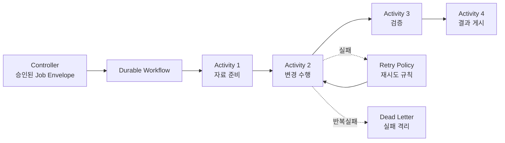

# Durable Workflow 설계 v0.9

> [!summary]
> 장시간 Worker 작업이 서버 재시작, Worker 장애, 승인 대기, 일시적 외부 오류 때문에 사라지지 않도록 **작업 진행상태를 영속적으로 보존하고 이어서 실행하는 계층**을 정의한다.

## 1. 용어 정의
- **Durable Workflow(내구성 작업흐름)**: 작업 진행상태를 영구 저장해 장애 후에도 이어서 실행할 수 있는 방식.
- **Workflow(작업흐름)**: 여러 Activity를 순서·조건·분기로 묶은 전체 실행 절차.
- **Activity(개별 실행 작업)**: 문서 변환, 테스트, 빌드, 배포처럼 Worker가 실제 수행하는 한 단계.
- **Retry(재시도)**: 일시적 실패에 대해 정해진 횟수와 간격으로 다시 수행하는 것.
- **Timeout(제한시간)**: 작업이 비정상적으로 오래 지속될 때 중단/실패로 판단하는 기준시간.
- **Task Queue(작업 대기열)**: Worker가 가져갈 Activity를 대기시키는 통로.
- **Checkpoint/State Persistence(진행상태 영속화)**: 현재 단계와 결과를 저장해 프로세스 재시작 후 복구하는 것.
- **Dead Letter(실패 격리)**: 자동 재시도로 해결되지 않는 작업을 별도 격리해 사람이 확인하게 하는 방식.

## 2. 필요한 이유
단순 Queue는 “해야 할 일 전달”에는 충분하지만 다음 상황이 길어질수록 운영 복잡도가 커진다.
- 30분~수시간 분석/빌드
- 사람 승인을 몇 시간 또는 다음날까지 대기
- 외부 API/DB 일시 장애
- Worker 프로세스 재시작
- Controller 서버 재배포
- 단계별 보상/롤백

따라서 Core에서는 Queue 자체가 아니라 **Durable Workflow 추상계층**을 기준으로 한다.

## 3. 기준 흐름

## 4. 구현 단계
### PoC / 초기 운영
- FastAPI Controller
- PostgreSQL에 Job/Workflow 상태 저장
- Redis/NATS/RabbitMQ/DB Queue 중 하나를 Adapter로 사용
- Retry/Timeout/Idempotency를 Rulmera 계약으로 구현

### 장시간·고신뢰 운영
- Temporal 같은 Durable Workflow Engine을 Adapter 뒤에 연결할 수 있다.
- 제품 Core는 특정 Workflow 제품의 SDK 객체를 외부 계약으로 노출하지 않는다.

## 5. Temporal의 위치
Temporal은 **Workflow 상태를 영속 저장하고 Activity 재시도·Timeout·Task Queue·장애복구를 제공하는 Durable Workflow Engine 계열 후보**다.

Rulmera에서의 원칙:
- PoC 필수 의존성으로 고정하지 않는다.
- 장기 실행/복구 요구가 커지는 시점에 우선 검토한다.
- `Workflow Adapter` 경계를 유지해 다른 엔진으로 교체 가능하게 한다.

## 6. 필수 상태 보존
- `workflow_id`
- `job_id` / `job_hash`
- 현재 단계
- 완료 Activity 목록
- 다음 실행 가능 Activity
- retry count / next retry time
- timeout/deadline
- 승인 대기 상태
- 외부 시스템 correlation id
- 마지막 오류
- 결과 Artifact 참조

## 7. 재시도 원칙
자동 Retry 대상:
- 일시적 네트워크 오류
- 일시적 서비스 unavailable
- Worker transient crash

자동 Retry 금지 또는 별도 검토:
- Production 삭제
- 데이터베이스 DDL
- 이미 외부 송금/발송처럼 되돌리기 어려운 Side Effect
- 승인 Job Hash 불일치
- OPA DENY

## 8. 완료 조건
Workflow는 `SUCCEEDED/FAILED/CANCELED/DENIED` 중 하나의 종료상태와 Result Contract를 남겨야 한다.
