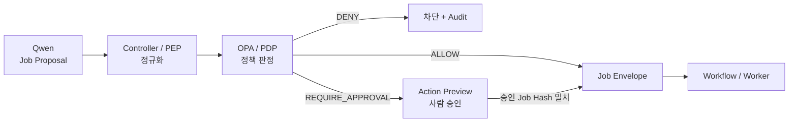

# Action Authorization Enforcement v0.9

> [!summary]
> 실행형 AI에서 권한을 Qwen의 판단에 맡기지 않고 **Worker Controller가 정책을 집행하고 OPA가 판정하도록 분리**하는 기준을 정의한다.

## 1. 용어 정의
- **PEP(Policy Enforcement Point, 정책 집행 지점)**: 정책 결정을 요청하고 그 결과를 실제 실행 차단/허용에 적용하는 지점. Rulmera에서는 Worker Controller가 담당한다.
- **PDP(Policy Decision Point, 정책 판단 지점)**: 요청의 신원·행동·대상·조건을 평가해 ALLOW/DENY/REQUIRE_APPROVAL을 반환하는 지점. Rulmera에서는 OPA가 담당한다.
- **Canonical Action Request(정규 행동 요청)**: Tool 이름뿐 아니라 실제 Resource/Path/Argument/Environment/Network/Side Effect까지 확정한 정책 입력.
- **Action Preview(실행 미리보기)**: 사람이 승인하기 전에 Controller가 실제 실행 내용을 사람이 읽을 수 있게 보여주는 요약.
- **Least Privilege(최소 권한)**: Worker에 해당 Job을 수행하는 데 필요한 권한만 일시적으로 주는 원칙.
- **Fail Closed(판정 불가 시 차단)**: 권한·승인·정책상태를 확인할 수 없으면 기본적으로 실행을 허용하지 않는 방식.

## 2. 권한 판정 흐름


## 3. 정책 입력 기준
최소 포함:
```json
{
  "actor": {"user_id":"u1","tenant_id":"tenant-a","roles":["engineer"]},
  "action": "workspace.write",
  "resource": "/tenant-a/radar/docs/**",
  "arguments": {"allow_delete":false,"max_files":100},
  "environment": "production",
  "network": "deny",
  "project_id": "radar",
  "requested_tool": "workspace.write"
}
```

## 4. Qwen 입력을 신뢰하지 않는 항목
Qwen이 다음을 제안할 수는 있지만 최종값으로 사용하지 않는다.
- 위험등급
- 실제 파일경로
- 대상 Tenant/Project
- 삭제 범위
- Production 여부
- 외부 네트워크 필요 여부
- Secret scope

Controller가 시스템 상태와 등록된 Tool Schema를 기준으로 재계산/확정한다.

## 5. 사람 승인 기준
사람에게 보여줄 내용은 Qwen의 자연어 설명이 아니라 Controller의 Action Preview다.

예:
```text
요청자       : user-001
프로젝트     : radar
행동         : repository.write
대상         : /tenant-a/radar/**
변경파일수   : 최대 17
삭제         : 없음
네트워크     : 차단
환경         : production
정책버전     : policy-20260917-03
Job Hash     : sha256:8c37...
```

승인 후 Action/Resource/Argument가 달라지면 Job Hash가 달라지므로 새 승인 필요.

## 6. 실행 직전 재검증
Worker가 실행하기 전 Controller/Workflow는 다음을 다시 확인한다.
- Job Hash
- 정책결정 유효기간
- 승인 유효기간
- Tenant/Project
- Worker Tool Capability
- Secret scope
- Network scope

## 7. Fail Closed 원칙
**Fail Closed(판정할 수 없으면 허용하지 않고 닫는 방식)**을 기본으로 한다.
- OPA 응답 없음 → DENY/대기
- 승인정보 누락 → 실행하지 않음
- 해시 불일치 → DENY
- Tool Schema 불일치 → DENY
- Worker Capability 불일치 → 재라우팅 또는 DENY
