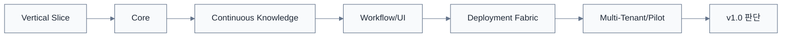

# 6개월 개발 로드맵 v0.5

> [!summary]
> 이 문서는 구현 순서, 개발 범위, 기술 적용 계획을 정리한 개발 기준 문서다.

> [!info]
> 표기 기준: 전문 용어는 가능하면 `원어(알기 쉬운 설명)` 형식을 사용하고, 공통 기준은 [[20-설계/00-용어-스타일-가이드]]를 따른다.

## Phase 0 — 2026-09-16 ~ 09-29
### Vertical Slice
- Qwen streaming
- RAG
- OPA
- Answer Contract
- Rulmera fixed template
- Citation Deep Link
- Voice smoke
- Golden 50

## Phase 1 — 2026-09 ~ 10월
### 기반 고도화
- 모델 benchmark
- Ingestion 형식 확대
- Metadata/Version/Approval schema
- Route Resolver
- Golden Set 확대

## Phase 2 — 2026-10 ~ 11월
### Continuous Knowledge Alpha
- Source Watcher
- Change Event
- AI Metadata candidate
- Security candidate
- Version resolver
- Project Candidate
- Incremental index

## Phase 3 — 2026-11 ~ 12월
### Workflow + UI Beta
- Expert Notes
- Approval Inbox
- Knowledge Inbox
- Knowledge Health
- Voice UX
- Responsive Web

## Phase 4 — 2026-12 ~ 2027-01월
### Deployment Fabric
- logical routes
- deployment manifest
- On-Prem profile
- Cloudflare profile
- S3 object adapter
- Parity suite
- Air-gap install draft

## Phase 5 — 2027-01 ~ 02월
### Multi-Tenant + Android/Pilot
- Tenant isolation
- OIDC/LDAP adapter
- Backup/restore
- Capacitor Android
- Pilot user tests

## Phase 6 — 2027-02 ~ 03-15
### 제품화
- Install/upgrade/rollback Runbook
- Customer Cloud profile
- Tenant template
- Demo package
- Pilot results
- v1.0 scope

