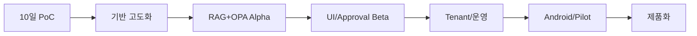

# 6개월 개발 로드맵

## Phase 0 — 2026-09-16 ~ 09-29
### 10일 PoC
기술·보안·UI 전체 흐름을 끝까지 연결한다.

## Phase 1 — 2026-09 ~ 10월
### 기반 고도화
- 모델 serving benchmark
- Ingestion 형식 확대
- Metadata/Version/Approval schema
- Golden Set 확대

## Phase 2 — 2026-10 ~ 11월
### RAG + OPA Alpha
- Hybrid retrieval/Reranker
- L0~L5 / RBAC+ABAC
- Audit
- Source/Citation
- Conflict/Version resolver

## Phase 3 — 2026-11 ~ 12월
### 운영 Workflow + UI Beta
- Expert Notes
- Approval Inbox
- Knowledge Health
- Responsive Web 기능 완성

## Phase 4 — 2026-12 ~ 2027-01월
### Enterprise 운영 기반
- Tenant 격리
- Identity Adapter
- Backup/restore
- policy test console
- 운영 모니터링

## Phase 5 — 2027-01 ~ 02월
### Android/Pilot
- Capacitor Android
- 파일/알림 등 필요한 plugin
- Pilot 사용자 테스트
- 평가/성능 최적화

## Phase 6 — 2027-02 ~ 03-15
### 제품화
- 설치/업그레이드/백업 Runbook
- 고객별 Tenant Template
- 영업 Demo 패키지
- Pilot 결과/가격/라이선스 초안
- v1.0 범위 확정

