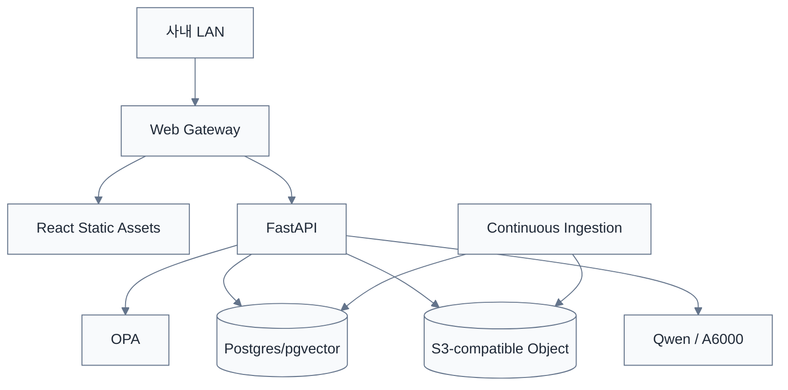
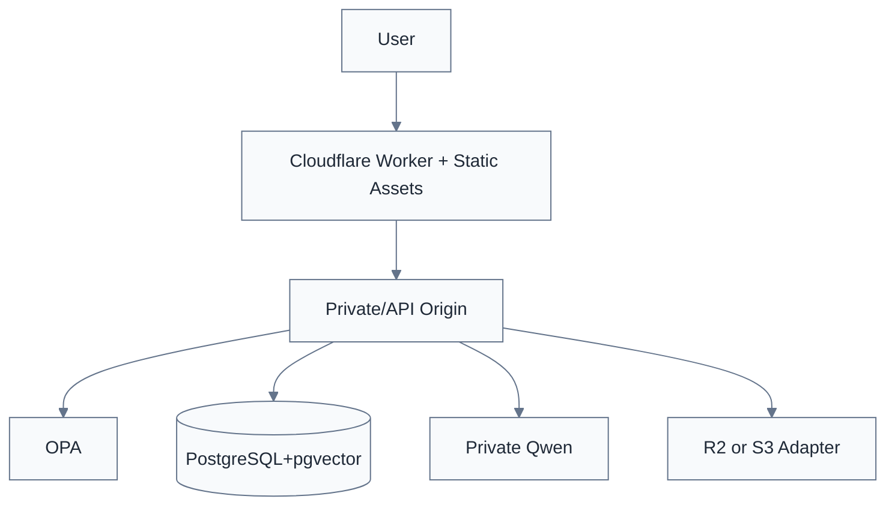

# 배포·운영계획 v0.8

> [!summary]
> 이 문서는 배포 방식, 운영 절차, 프로파일별 차이를 정리한 운영 기준 문서다.

> [!info]
> 표기 기준: 전문 용어는 가능하면 `원어(알기 쉬운 설명)` 형식을 사용하고, 공통 기준은 [[20-설계/00-용어-스타일-가이드]]를 따른다.

## 운영 원칙

**Build Once, Deploy Anywhere**

동일 Rulmera Core와 UI를 유지하고 배포 Profile만 바꾼다.

## Profile A — On-Prem / Private

- 외부망 없이 운영 가능
- Docker Compose PoC
- 운영규모에 따라 Container/K8s 선택
- MinIO 등 S3-compatible storage
- Private Qwen

## Profile B — Cloudflare-assisted

- Web/Edge 전달에 Cloudflare 사용 가능
- 기밀 AI/DB는 Private Origin에 유지 가능
- Tenant 정책에 따라 Full/Hybrid 구성

## Profile C — Customer Cloud
- 고객 VM/Kubernetes
- 고객 LB/Ingress
- PostgreSQL
- S3-compatible Object
- 고객 OIDC/LDAP
- Private Qwen endpoint

## 공통 서비스
- frontend
- api
- opa
- postgres/pgvector
- model-server
- ingestion-worker
- worker-controller
- execution-worker
- job-queue adapter
- result-store
- object-storage adapter
- route-resolver
- audit service

## 배포 Manifest
[[03-배포-프로파일-표준]] 참조.

## 백업
- 원본문서: 매일 증분
- PostgreSQL: 일일 dump + 주간 full
- OPA policy/data: Git + 배포 snapshot
- Connector config: secret 제외 versioning
- Vector index: 재생성 가능하지만 snapshot 검토
- Deployment manifest: 릴리스와 함께 보관

## 업그레이드
1. Manifest/DB schema 호환성 검사
2. Backup snapshot
3. 새 이미지/정적 build 배포
4. Migration
5. Smoke + Parity test
6. 실패 시 Rollback

## 운영 로그
- application
- inference latency/token
- retrieval top docs
- OPA decision
- audit event
- ingestion event/error
- execution job state/event
- action OPA decision
- worker tool invocation
- worker validation/result
- approval gate / approver
- project candidate
- classification suggestion/override
- deployment profile/version
- system GPU/CPU/RAM/disk

## Worker 운영 경계
- `ingestion-worker`와 `execution-worker`는 별도 배포 단위로 운영한다.
- execution-worker는 최소권한 service account를 사용한다.
- Production Worker는 Development Worker보다 Tool/Network/Secret 권한을 더 좁게 둔다.
- Queue와 Result Store 장애 시 Job 유실 없이 재처리 가능하도록 event/state를 영속화한다.
- Git Adapter를 끄더라도 API/Queue 방식으로 동일 Job Contract를 처리할 수 있어야 한다.
