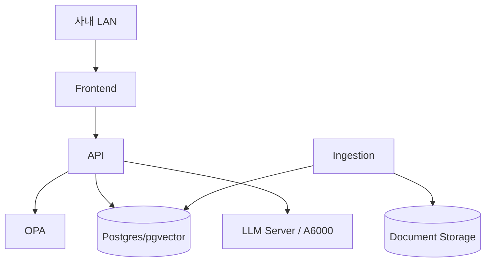

# 배포·운영계획

## PoC 배포
Docker Compose 기준:
- frontend
- api
- opa
- postgres/pgvector
- model-server
- ingestion-worker
- optional minio

## 환경
- DEV: 윤석훈 Windows 개발환경, Browser/Android viewport 즉시 확인
- AI Server: Linux 권장, A6000 GPU
- TEST/PILOT: 고객 또는 룰메라 On-Prem 환경

## 백업
- 원본문서: 매일 증분
- PostgreSQL: 일일 dump + 주간 full
- OPA policy/data: Git + 배포 snapshot
- Config/secret: 별도 안전 저장
- Vector는 재생성 가능하지만 복구시간 단축을 위해 snapshot 검토

## 운영 로그
- application
- inference latency/token
- retrieval top docs
- OPA decision
- audit event
- ingestion error
- system GPU/CPU/RAM/disk
