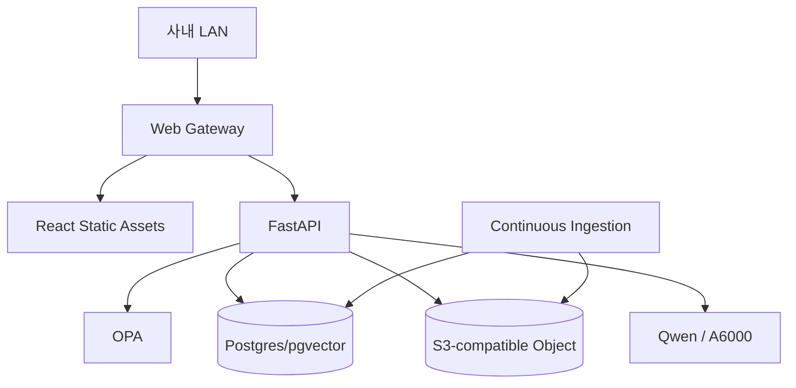
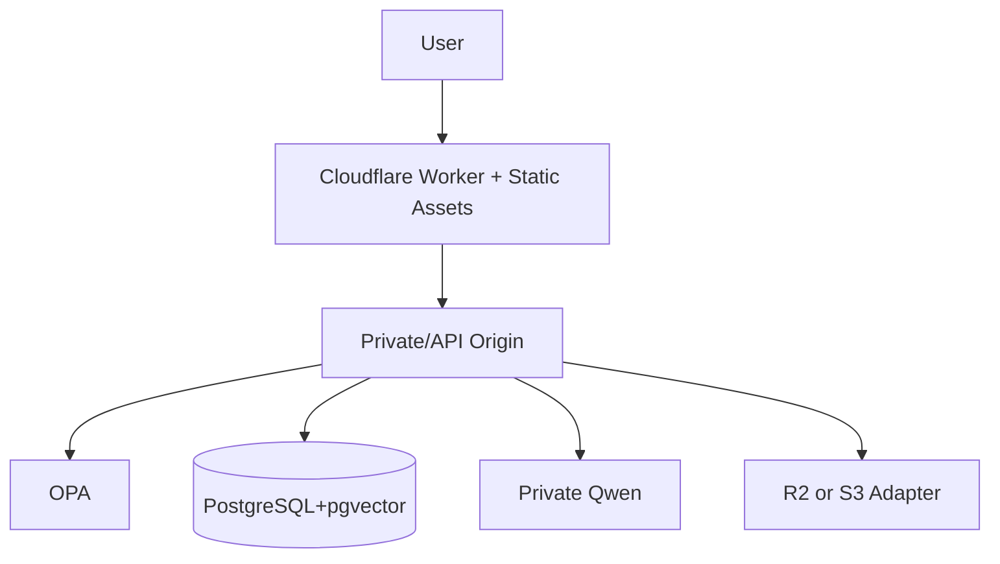

# 배포·운영계획 v0.3

## 운영 원칙

**Build Once, Deploy Anywhere**

동일 Rulmera Core와 UI를 유지하고 배포 Profile만 바꾼다.

## Profile A — On-Prem / Private

- 외부망 없이 운영 가능
- Docker Compose PoC
- 운영규모에 따라 Container/K8s 선택
- MinIO 등 S3-compatible storage
- Private Qwen

## Profile B — Cloudflare-assisted

- Web/Edge 전달에 Cloudflare 사용 가능
- 기밀 AI/DB는 Private Origin에 유지 가능
- Tenant 정책에 따라 Full/Hybrid 구성

## Profile C — Customer Cloud
- 고객 VM/Kubernetes
- 고객 LB/Ingress
- PostgreSQL
- S3-compatible Object
- 고객 OIDC/LDAP
- Private Qwen endpoint

## 공통 서비스
- frontend
- api
- opa
- postgres/pgvector
- model-server
- ingestion-worker
- object-storage adapter
- route-resolver
- audit service

## 배포 Manifest
[[03-배포-프로파일-표준]] 참조.

## 백업
- 원본문서: 매일 증분
- PostgreSQL: 일일 dump + 주간 full
- OPA policy/data: Git + 배포 snapshot
- Connector config: secret 제외 versioning
- Vector index: 재생성 가능하지만 snapshot 검토
- Deployment manifest: 릴리스와 함께 보관

## 업그레이드
1. Manifest/DB schema 호환성 검사
2. Backup snapshot
3. 새 이미지/정적 build 배포
4. Migration
5. Smoke + Parity test
6. 실패 시 Rollback

## 운영 로그
- application
- inference latency/token
- retrieval top docs
- OPA decision
- audit event
- ingestion event/error
- project candidate
- classification suggestion/override
- deployment profile/version
- system GPU/CPU/RAM/disk
