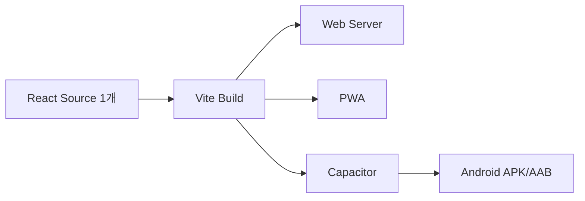

# Android/PWA 배포전략

## 1차
브라우저 + PWA로 기능을 먼저 완성한다. Android에서도 Chrome/PWA로 즉시 검증 가능하다.

## 2차
동일 Web build를 Capacitor로 패키징한다.

## Android Native 기능은 최소화
- 파일 선택/업로드
- 다운로드/열기
- Push notification(승인대기 등, 필요 시)
- 카메라/사진 첨부(현장지식 수집 시)
- 안전한 토큰 저장

## 배포 후보
- 사내 APK sideload
- MDM
- Google Play 비공개/내부테스트

PoC에서는 **APK가 목적이 아니라 동일 UI/동일 API가 Android에서 문제없이 동작하는지**를 먼저 확인한다.
