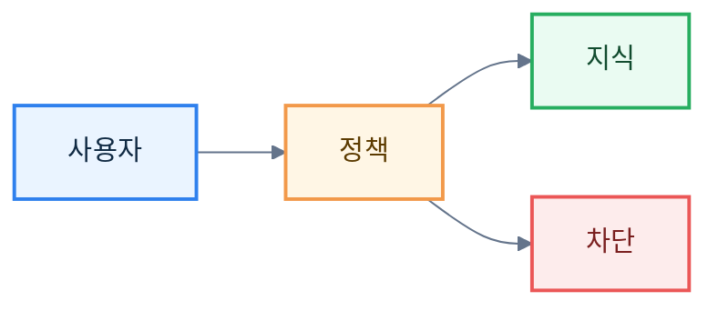

# Mermaid 공통 테마 v0.5

> [!summary]
> 이 문서는 문서 표현, 도식 스타일, CSS 적용 기준을 통일하기 위한 스타일 시스템 문서다.

> [!info]
> 표기 기준: 전문 용어는 가능하면 `원어(알기 쉬운 설명)` 형식을 사용하고, 공통 기준은 [[20-설계/00-용어-스타일-가이드]]를 따른다.

## 공통 init 블록

## 권장 classDef 예시

