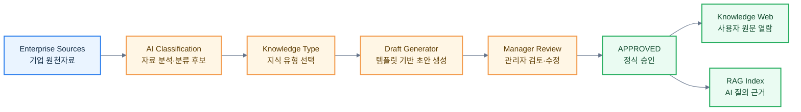

# Rulmera Knowledge Type 규격 홈 v0.7

> [!summary]
> 이 문서는 Obsidian Template 자체가 아니라, Rulmera가 기업 지식을 어떤 종류로 만들고 어떤 필드를 필수로 관리하며 AI가 어떻게 초안을 생성할지를 정의하는 **정식 Knowledge Schema(지식 규격)** 의 기준 문서다.

## 왜 필요한가
초기 PoC에서는 Obsidian Template으로 지식을 작성할 수 있지만, 장기적으로는 Rulmera Manager와 향후 Rulmera Knowledge Studio가 같은 규격을 직접 사용해야 한다.

즉 다음 구조를 유지한다.

## 정식 Knowledge Type
| Type ID | 이름 | 주요 용도 | 기본 사람승인 |
|---|---|---|---|
| `GENERAL` | General Knowledge(일반 지식) | 매뉴얼, 절차, 기술 설명 | 정책에 따라 |
| `INCIDENT` | Incident / Troubleshooting(장애 사례) | 장애·고장·원인·조치 | 필수 권장 |
| `DECISION` | Decision Record(의사결정 기록) | 설계·기술·업무 선택 이유 | 필수 |
| `MEETING` | Meeting Record(회의 기록) | 논의·확정·미결·액션아이템 | 정책에 따라 |
| `EXPERT_NOTE` | Expert Note(전문가 노트) | 숙련자의 암묵지·판단순서 | 필수 |
| `PROJECT_CANDIDATE` | Project Candidate(신규 프로젝트 후보) | AI가 새 프로젝트로 감지한 자료묶음 | 필수 |

## 공통 필수 메타데이터
- `knowledge_id` — 정식 승인 시 Rulmera가 발급하는 지식 식별자
- `tenant_id` — 고객 회사 식별자
- `project_id` — 프로젝트 식별자. 미확정이면 후보 상태로 관리
- `knowledge_type` — 위 Knowledge Type
- `security_level` — L0~L5
- `approval_status` — DRAFT / REVIEW / APPROVED / REJECTED / SUPERSEDED / REVOKED
- `revision` — Rev.1, Rev.2 등
- `owner` — 지식 책임자
- `source_uri` — 원천자료 위치
- `created` / `last_updated`

## AI가 확정하면 안 되는 값
다음은 AI가 **후보만 제시**한다.
- `security_level`
- `approval_status=APPROVED`
- 신규 `project_id` 확정
- `approver`
- NDA 적용 여부의 최종 확정
- 정본 우선순위의 최종 확정

## 관련 세부 규격
- [[96-템플릿/Knowledge-Type-Spec/01-GENERAL-일반지식-규격]]
- [[96-템플릿/Knowledge-Type-Spec/02-INCIDENT-장애사례-규격]]
- [[96-템플릿/Knowledge-Type-Spec/03-DECISION-의사결정-규격]]
- [[96-템플릿/Knowledge-Type-Spec/04-MEETING-회의기록-규격]]
- [[96-템플릿/Knowledge-Type-Spec/05-EXPERT-NOTE-전문가노트-규격]]
- [[96-템플릿/Knowledge-Type-Spec/06-PROJECT-CANDIDATE-신규프로젝트후보-규격]]
- [[96-템플릿/Knowledge-Type-Spec/07-AI-자동생성-공통규칙]]
- [[96-템플릿/Knowledge-Type-Spec/08-승인-상태전이-규칙]]
