# AI 자동생성 공통 규칙 v0.7

> [!summary]
> 기업에 들어온 자료를 AI가 분석해 Knowledge Type 후보를 결정하고 초안을 만드는 공통 절차를 정의한다.

## 처리 순서

```mermaid
%%{init: {"theme":"base","themeVariables":{"primaryColor":"#F8FAFC","primaryTextColor":"#1F2937","primaryBorderColor":"#64748B","lineColor":"#64748B","secondaryColor":"#EAF4FF","tertiaryColor":"#EAFBF2","clusterBkg":"#F8FAFC","clusterBorder":"#CBD5E1","fontSize":"15px"}} }%%
flowchart LR
  A[Source File<br/>원천자료] --> B[Extract<br/>텍스트·표·이미지 추출]
  B --> C[Classify<br/>지식유형 후보]
  C --> D[Project Match<br/>프로젝트 연결 후보]
  D --> E[Security Candidate<br/>보안등급 후보]
  E --> F[Template Fill<br/>지식 초안 생성]
  F --> G[Validation<br/>필수필드·근거 확인]
  G --> H[Manager Review<br/>관리자 검토]
  H --> I[Approve / Reject<br/>승인·반려]
```


## AI 출력 최소 구조
```yaml
knowledge_type_candidate: INCIDENT
confidence: 0.91
project_candidate: jungnang
security_candidate: L3
title_candidate: "M203(송풍기) 인버터 과전류 장애 사례"
required_fields_missing:
  - occurred_at
source_refs:
  - source_uri: "..."
    locator: "page:4"
```

## 공통 규칙
1. 원문에 없는 사실을 만들어 채우지 않는다.
2. 불명확한 항목은 빈칸 또는 `확인 필요`로 둔다.
3. 모든 핵심 주장에는 source reference(출처 위치)를 연결한다.
4. 동일 문서/유사 문서와 중복검사를 한다.
5. 기존 최신 승인본보다 새 버전인지 판별한다.
6. 보안등급은 후보만 생성한다.
7. 승인 전에는 사용자 Web과 RAG 정본에 반영하지 않는다.
8. 프로젝트가 불명확하면 신규 Project Candidate 또는 관리자 선택을 요구한다.
