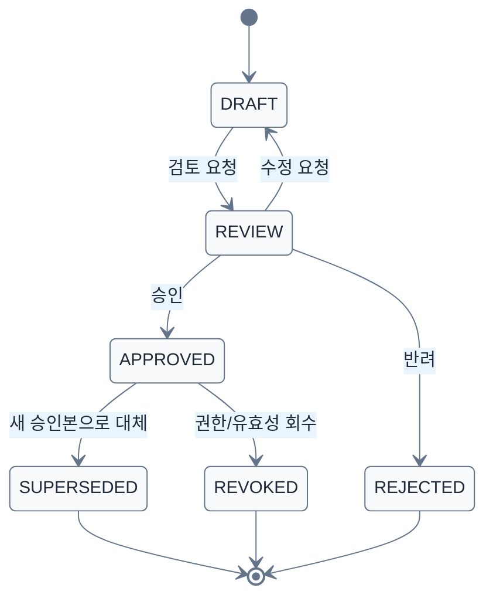

# Approval Lifecycle(승인 상태전이) 규칙 v0.7

> [!summary]
> 지식 후보가 사용자와 AI가 사용할 수 있는 승인 정본이 되기까지의 상태를 정의한다.

## 상태 의미
- `DRAFT`: AI 또는 사람이 만든 초안
- `REVIEW`: 관리자/전문가 검토 중
- `APPROVED`: 사용자 Web과 RAG가 사용할 수 있는 정본
- `REJECTED`: 잘못된 후보 또는 사용하지 않기로 한 지식
- `SUPERSEDED`: 더 최신 승인본으로 대체된 과거 정본
- `REVOKED`: 보안·계약·유효성 문제로 사용 중지된 지식

## 게시 규칙
- Web 게시 가능: 기본적으로 `APPROVED`만
- RAG 검색 가능: 기본적으로 `APPROVED`만
- 과거 이력 조회: 권한 있는 관리자에게 `SUPERSEDED` 허용 가능
- `REVOKED`는 일반 검색에서 즉시 제외
